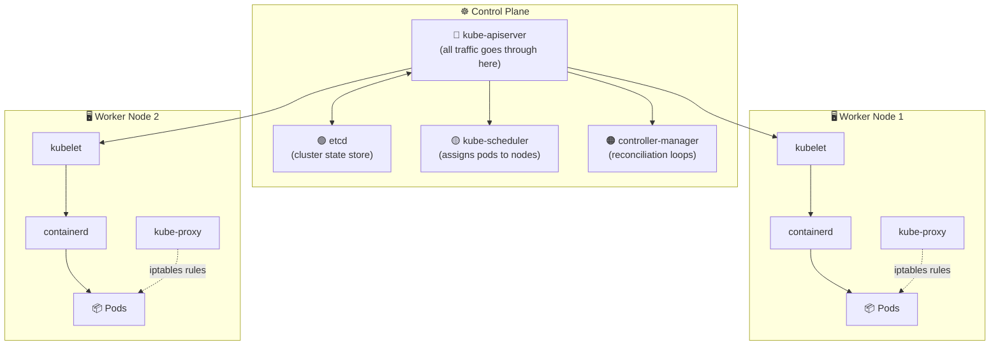

# Cluster Architecture

## Overview

Kubernetes is designed to **host applications in containers** in an automated fashion — deploying, scaling, and enabling communication between them. A Kubernetes cluster is made up of two types of nodes:

| Node Type | Role |
| --- | --- |
| **Master / Control Plane** | Manages the cluster — scheduling, monitoring, orchestrating |
| **Worker Nodes** | Run application workloads (containers) |

## Cluster Architecture Diagram

## The Ship Analogy

Think of a Kubernetes cluster like a fleet of ships:

- **Cargo ships** = Worker nodes that carry containers (workloads)
- **Control ship** = Master node that manages and monitors the fleet
- **ETCD** = The ship’s log — records everything loaded, where, and when
- **Schedulers** = Cranes that place containers onto ships based on capacity
- **Controllers** = Operations teams that manage different functions
- **kube-apiserver** = The captain — orchestrates all operations

## Control Plane Components

| Component | Purpose |
| --- | --- |
| `etcd` | Distributed key-value store — the single source of truth for cluster state |
| `kube-apiserver` | Front-end for the control plane; all communication goes through it |
| `kube-scheduler` | Decides which node a pod runs on |
| `kube-controller-manager` | Runs all controller loops (node, replication, endpoints, etc.) |
| `cloud-controller-manager` | Integrates with cloud provider APIs (optional) |

## Worker Node Components

| Component | Purpose |
| --- | --- |
| `kubelet` | Agent on each node; registers node, starts/stops pods, reports health |
| `kube-proxy` | Maintains network rules (iptables/ipvs) for Service routing |
| **Container Runtime** | Actually runs containers (containerd, CRI-O, Docker via shim) |
