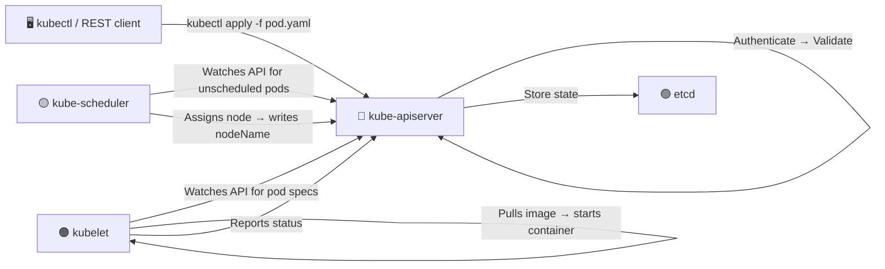

# kube-apiserver

## Role

The **kube-apiserver is the primary management component** of Kubernetes. All other components communicate through it — nothing talks to etcd directly except the API server.

## Request Flow



## Key Responsibilities

1. **Authenticate** the request
2. **Validate** the request
3. **Retrieve / update** data in etcd
4. **Return** response to the caller

## Configuration

```bash
# kubeadm: API server runs as a static pod
cat /etc/kubernetes/manifests/kube-apiserver.yaml

# Manual: systemd service
cat /etc/systemd/system/kube-apiserver.service

# View running process flags
ps aux | grep kube-apiserver
```

## Important Flags

| Flag | Purpose |
| --- | --- |
| `--etcd-servers` | etcd endpoint(s) |
| `--client-ca-file` | CA for verifying clients |
| `--tls-cert-file` / `--tls-private-key-file` | API server's own TLS cert/key |
| `--service-cluster-ip-range` | IP range for Services |
| `--authorization-mode` | e.g. `Node,RBAC` |