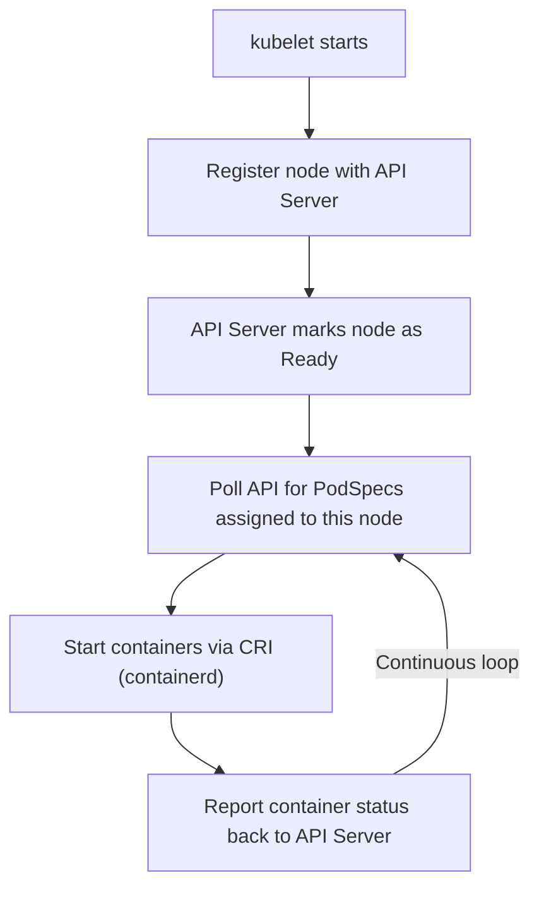

# kubelet

## Role

The **kubelet is the primary node agent**. It runs on every worker node and is responsible for:

- Registering the node with the API server
- Receiving PodSpec from the API server
- Pulling container images and starting containers via the container runtime
- Monitoring pod/container health and reporting back to the API server

## Important Note

> ⚠️ **kubeadm does NOT deploy kubelet**. You must install kubelet manually on each worker node.

```bash
# Install on worker node
apt-get install -y kubelet

# Check status
systemctl status kubelet

# View running process and flags
ps aux | grep kubelet
```

## kubelet Startup Flow


