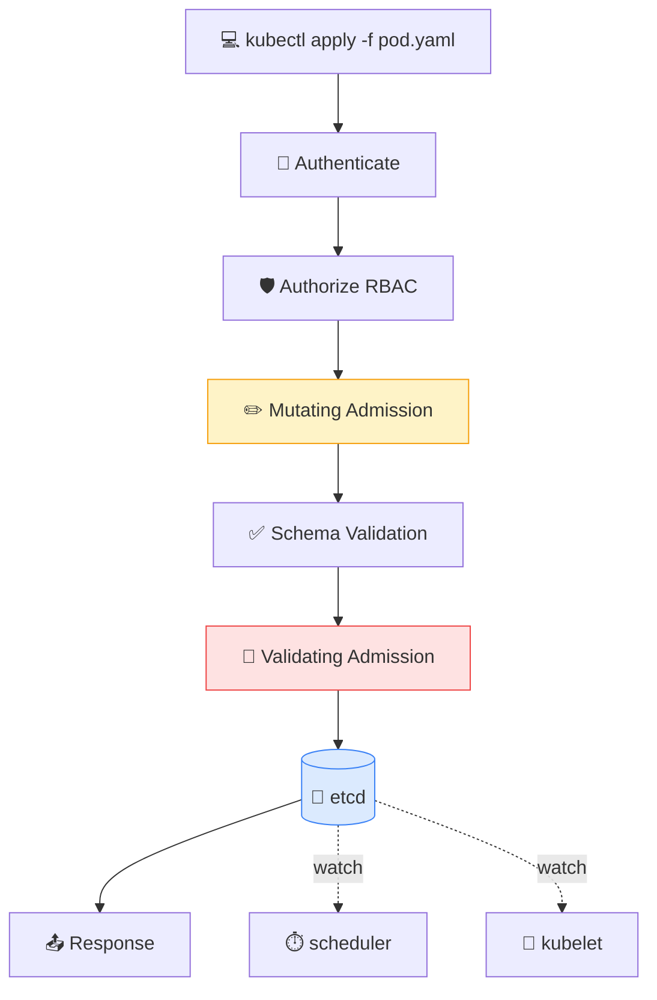

# Request Flow

```mermaid
flowchart TD
    K["💻 kubectl apply -f pod.yaml"]
    A["🔐 Authenticate"]
    B["🛡️ Authorize RBAC"]
    C["✏️ Mutating Admission"]
    D["✅ Schema Validation"]
    E["🚫 Validating Admission"]
    F[("💾 etcd")]
    G["📤 Response"]
    SCHED["⏱️ scheduler"]
    KL["🤖 kubelet"]
    K --> A --> B --> C --> D --> E --> F --> G
    F -.->|watch| SCHED & KL
    style C fill:#fef3c7,stroke:#f59e0b
    style E fill:#fee2e2,stroke:#ef4444
    style F fill:#dbeafe,stroke:#3b82f6
```
