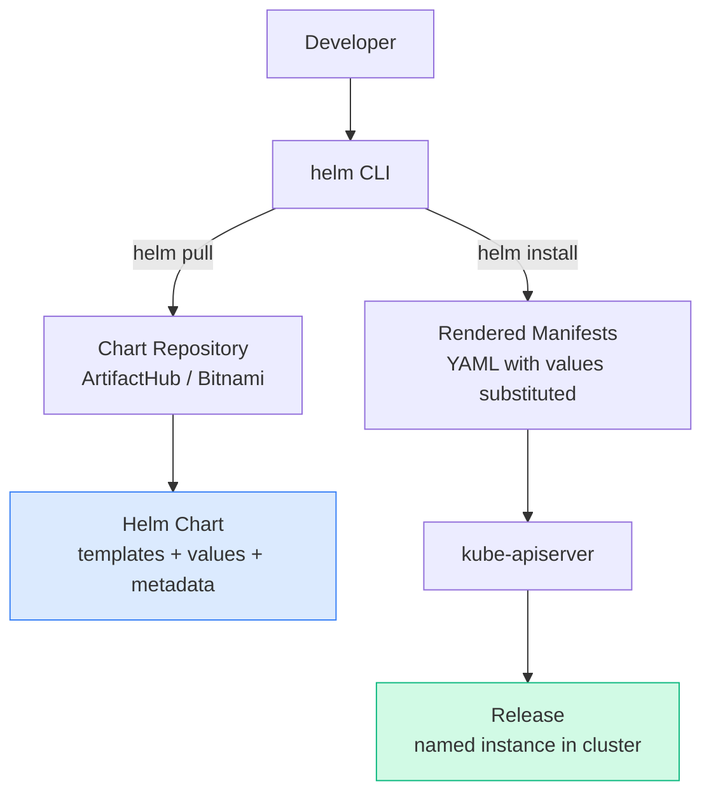

# Overview
> **Source:** KodeKloud CKA Course — Helm Section (2025 Updates) | 📅 June 2026

Helm is the **package manager for Kubernetes** — it bundles related Kubernetes manifests into reusable, versioned packages called **charts**. Added to the CKA exam in 2025.

---

# Flow: How Helm Works

---

# 1. Core Concepts

[Table Placeholder]
