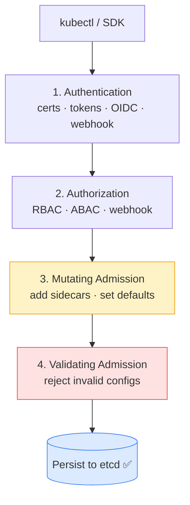

# 1.1 kube-apiserver
> The **front door** of the Kubernetes cluster. All communication — internal or external — goes through the API Server.

**What it does:**

- Exposes the Kubernetes REST API
- Authenticates and authorizes all requests
- Validates and persists cluster state to etcd
- Acts as the central hub for all component communication
- Implements admission control (webhooks, OPA, etc.)
**Key characteristics:**

- Stateless — can be horizontally scaled
- Only component that directly reads/writes etcd
- Uses watch API so components get real-time updates (no polling)

---
