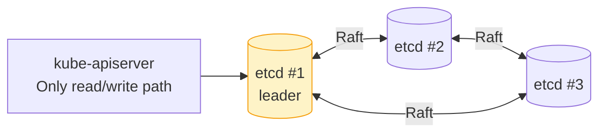

# 1.2 etcd
> The **single source of truth** — a distributed key-value store that holds ALL cluster state.

**What it does:**

- Stores all Kubernetes objects: Pods, Services, ConfigMaps, Secrets, etc.
- Uses the Raft consensus algorithm for high availability
- Provides watch semantics — components react to changes in real-time
**Key characteristics:**

- Strongly consistent reads and writes
- Only kube-apiserver talks directly to etcd
- In production: run as a 3 or 5 node cluster for quorum
- Data stored under `/registry/` namespace prefix

---
