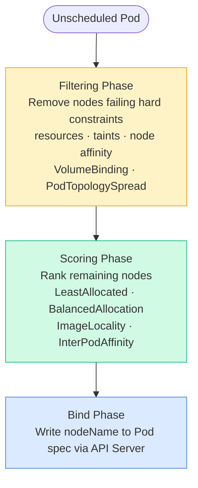

# 1.3 kube-scheduler
> Decides **which node** a newly created Pod should run on.

**Scheduling Pipeline:**

**Filtering plugins:** NodeResourcesFit, NodeAffinity, TaintToleration, PodTopologySpread, VolumeBinding

**Scoring plugins:** LeastAllocated, BalancedAllocation, ImageLocality, InterPodAffinity

---
