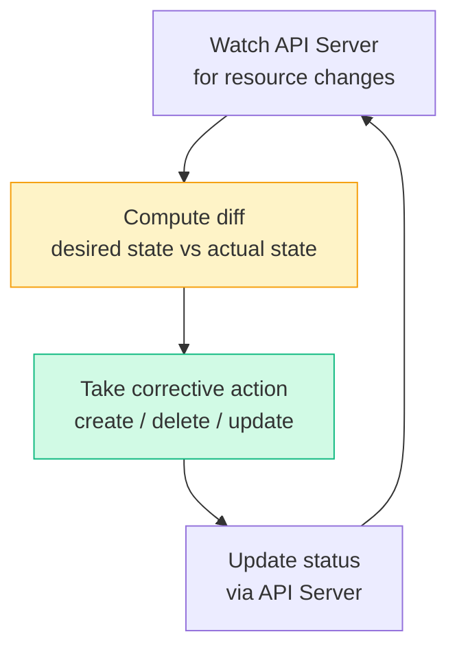

# 1.4 kube-controller-manager
> Runs all **control loops** that reconcile desired state with actual state. Each controller watches the API Server and drives the cluster toward the desired state.

**Key Controllers:**

[Table Placeholder]

**Reconciliation Loop Pattern:**

---
