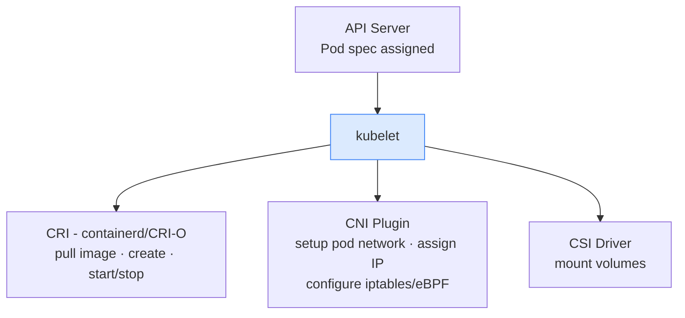

# 2.1 kubelet
> The **node agent** — runs on every worker node and manages Pods on that node.

**What it does:**

- Watches API Server for Pods assigned to its node
- Calls the Container Runtime Interface (CRI) to start/stop containers
- Reports node and Pod status back to API Server
- Runs liveness, readiness, and startup probes
- Mounts volumes (calls CSI driver)
- Manages pod networking (calls CNI plugin)

---
