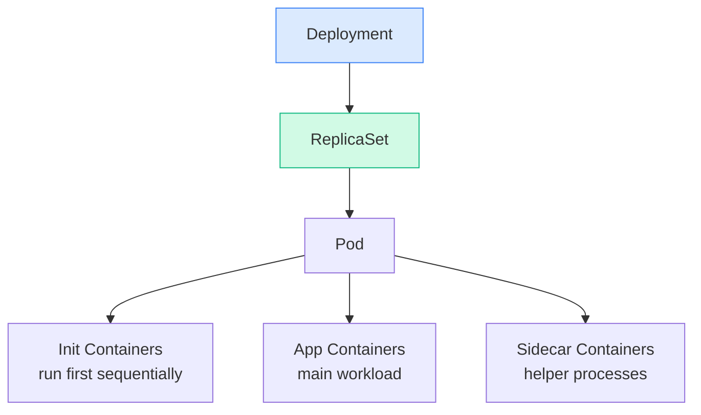

# 3.1 Core Workload Objects

```mermaid
graph TD
    D["Deployment"]
    RS["ReplicaSet"]
    POD["Pod"]
    IC["Init Containers\nrun first sequentially"]
    AC["App Containers\nmain workload"]
    SC["Sidecar Containers\nhelper processes"]
    D --> RS --> POD
    POD --> IC & AC & SC
    style D fill:#dbeafe,stroke:#3b82f6
    style RS fill:#d1fae5,stroke:#10b981
```

[Table Placeholder]

---
