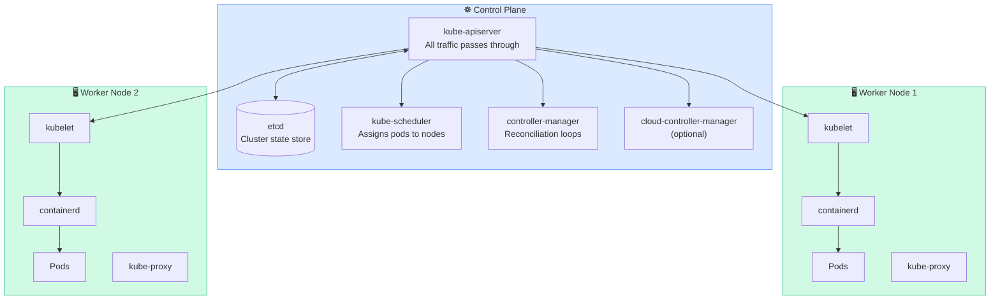

# 📐 High-Level Architecture Diagram

```mermaid
graph TD
    subgraph CP["☸️ Control Plane"]
        API["kube-apiserver\nAll traffic passes through"]
        ETCD[("etcd\nCluster state store")]
        SCHED["kube-scheduler\nAssigns pods to nodes"]
        CTRL["controller-manager\nReconciliation loops"]
        CCM["cloud-controller-manager\n(optional)"]
    end
    subgraph W1["🖥️ Worker Node 1"]
        KL1["kubelet"] --> CR1["containerd"] --> P1["Pods"]
        KP1["kube-proxy"]
    end
    subgraph W2["🖥️ Worker Node 2"]
        KL2["kubelet"] --> CR2["containerd"] --> P2["Pods"]
        KP2["kube-proxy"]
    end
    API <--> ETCD
    API --> SCHED & CTRL & CCM
    API --> KL1 & KL2
    style CP fill:#dbeafe,stroke:#3b82f6
    style W1 fill:#d1fae5,stroke:#10b981
    style W2 fill:#d1fae5,stroke:#10b981
```

---
