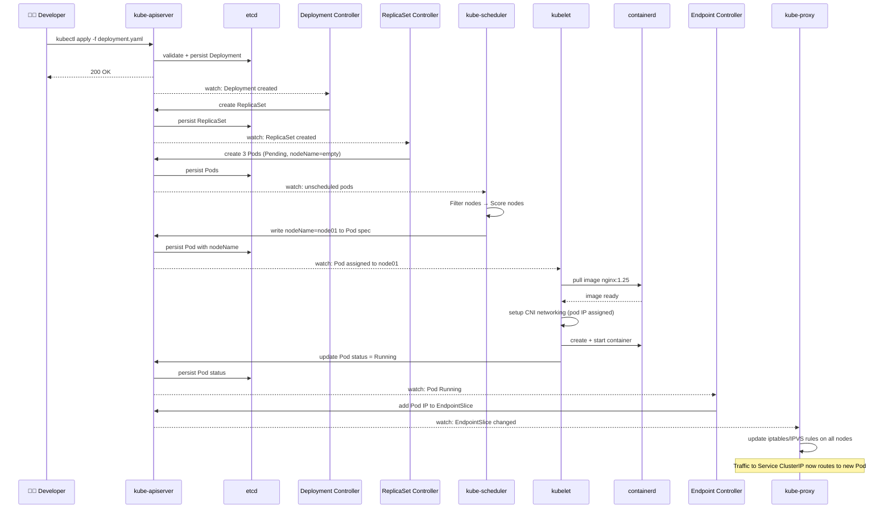
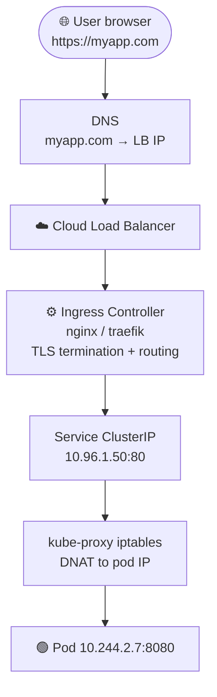

# Full Pod Lifecycle

> Part of **02 ☸️ Kubernetes Architecture** | CKA Chapter 2

Trace exactly what happens, step by step, from `kubectl apply` to a running pod serving traffic.

---

# Full Flow: kubectl apply → Running Pod → Serving Traffic



---

# External Traffic Flow



---

# Key Concepts Summary

```bash
# Watch a deployment rollout step by step
kubectl get pods -w

# Trace events for a pod
kubectl describe pod <name> | grep -A20 Events

# See full pod spec as API server sees it
kubectl get pod <name> -o yaml
```

