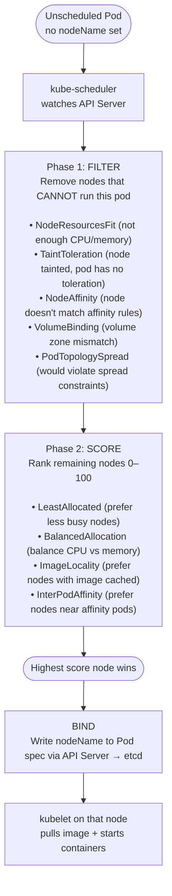
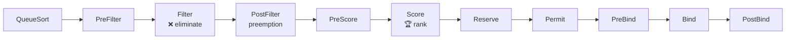
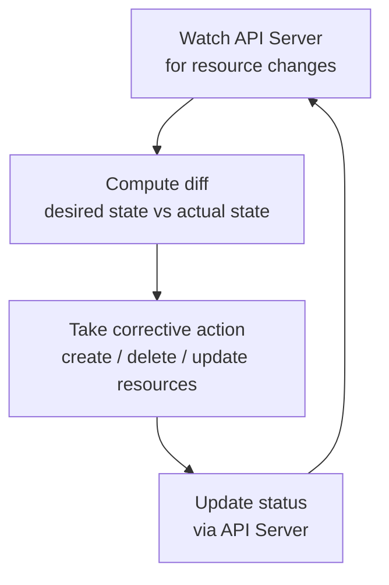

# kube-scheduler & controller-manager

> Part of **02 ☸️ Kubernetes Architecture** | CKA Chapter 2

---

# kube-scheduler — Where Do Pods Go?

The scheduler watches for pods with no `nodeName` set and assigns them to the best available node.

## Scheduling Pipeline



## Scheduler Extension Points



```bash
# View scheduler static pod
cat /etc/kubernetes/manifests/kube-scheduler.yaml

# Check scheduler logs
kubectl logs -n kube-system kube-scheduler-controlplane

# Why is a pod Pending? (scheduler couldn't place it)
kubectl describe pod <pending-pod> | grep -A10 Events
```

---

# kube-controller-manager — The Reconciliation Engine

Runs all **control loops** inside a single binary. Each controller watches the API Server and drives the cluster toward the desired state.

## Reconciliation Loop (how every controller works)



## Key Controllers

```bash
# View controller-manager static pod
cat /etc/kubernetes/manifests/kube-controller-manager.yaml

# Check logs
kubectl logs -n kube-system kube-controller-manager-controlplane
```

