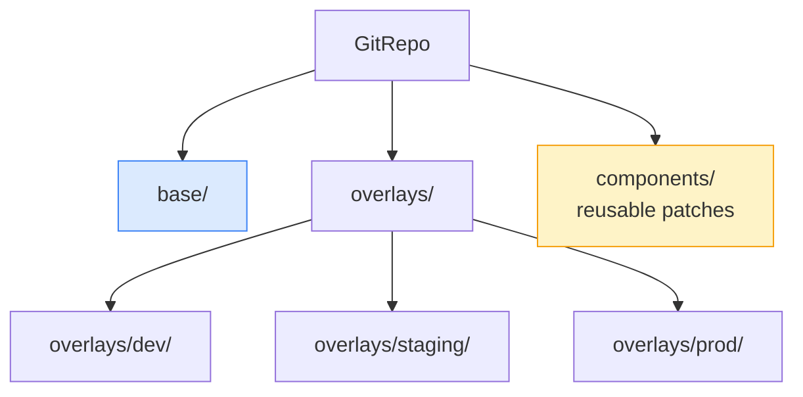

# JSON Patch
```yaml
# Inline JSON patch in kustomization.yaml
patches:
- patch: |-
    - op: replace
      path: /spec/replicas
      value: 5
    - op: add
      path: /spec/template/spec/containers/0/env
      value:
      - name: ENV
        value: production
    - op: remove
      path: /spec/template/spec/containers/0/livenessProbe
  target:
    kind: Deployment
    name: myapp
    namespace: production
```

[Table Placeholder]

---

# 7. ConfigMapGenerator & SecretGenerator

```yaml
# kustomization.yaml
configMapGenerator:
- name: app-config
  literals:
  - APP_COLOR=blue
  - APP_MODE=production
  files:
  - config.properties              # file contents as value

# Auto-appends hash to name: app-config-abc123def
# Forces pod restart when configmap changes
```

```yaml
secretGenerator:
- name: db-secret
  literals:
  - DB_PASSWORD=mysecret
  type: Opaque
```

```bash
# Disable hash suffix if needed
configMapGenerator:
- name: app-config
  options:
    disableNameSuffixHash: true
  literals:
  - KEY=value
```

---

# 8. Managing Directories



```yaml
# Referencing other directories
resources:
- ../../base
- ../common-configs
- https://github.com/myorg/k8s-base//overlays/prod  # remote base
```

---

# 9. Commands

```bash
# Preview output (don't apply)
kubectl kustomize ./overlays/prod/
kubectl kustomize ./overlays/prod/ > prod-manifests.yaml

# Standalone binary
kustomize build overlays/prod/
kustomize build overlays/prod/ | kubectl apply -f -

# Apply
kubectl apply -k overlays/prod/
kubectl apply -k base/

# Diff before applying
kubectl diff -k overlays/prod/

# Delete resources
kubectl delete -k overlays/prod/

# Edit kustomization (adds resources, patches etc.)
kustomize edit add resource deployment.yaml
kustomize edit set image myapp=myapp:v2.1.0
kustomize edit set namespace production
```

---

# 10. Real-World Example — Full Structure

```javascript
my-app/
├── base/
│   ├── kustomization.yaml
│   ├── deployment.yaml
│   ├── service.yaml
│   └── configmap.yaml
├── overlays/
│   ├── dev/
│   │   ├── kustomization.yaml    # bases + patches
│   │   └── dev-patch.yaml
│   ├── staging/
│   │   └── kustomization.yaml
│   └── prod/
│       ├── kustomization.yaml
│       └── prod-patch.yaml
└── components/
    └── monitoring/               # reusable component
        ├── kustomization.yaml
        └── servicemonitor.yaml
```

```bash
# Deploy to different envs
kubectl apply -k overlays/dev/
kubectl apply -k overlays/staging/
kubectl apply -k overlays/prod/
```

---

# Quick Reference

```bash
# Build / Preview
kubectl kustomize <dir>                    # print rendered YAML
kubectl kustomize <dir> > output.yaml
kustomize build <dir>

# Apply
kubectl apply -k <dir>
kubectl diff -k <dir>                      # preview changes
kubectl delete -k <dir>

# Edit
kustomize edit add resource <file>
kustomize edit set image <name>=<newname>:<tag>
kustomize edit set namespace <ns>

# Kustomization features
# resources:       list of files/dirs to manage
# bases:           parent kustomization dirs
# patches:         strategic merge or JSON patches
# images:          override image names/tags
# namePrefix:      prefix all resource names
# nameSuffix:      suffix all resource names
# namespace:       set namespace on all resources
# commonLabels:    add labels to all resources
# configMapGenerator:  generate ConfigMaps
# secretGenerator:     generate Secrets
```

> 📚 **Ref:** [Kustomize Docs](https://kustomize.io/) | [kubectl kustomize](https://kubernetes.io/docs/tasks/manage-kubernetes-objects/kustomization/)
