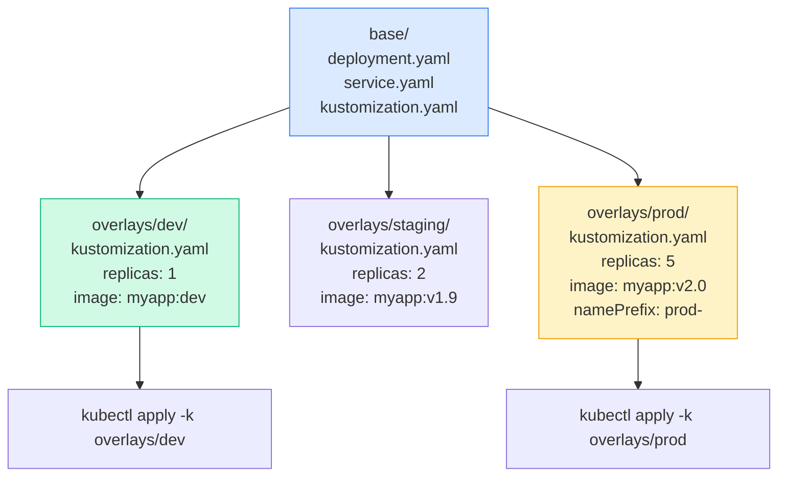

# Overview
> **Source:** KodeKloud CKA Course — Kustomize Section (2025 Updates) | 📅 June 2026

Kustomize is **built into kubectl** — an overlay-based tool for managing Kubernetes configurations across environments without templating languages. Added to the CKA exam in 2025.

```bash
# Built into kubectl (no install needed)
kubectl apply -k ./overlays/prod/
kubectl kustomize ./overlays/prod/
```

---

# Flow: Kustomize Architecture



---

# 1. Kustomize vs Helm

[Table Placeholder]

---

# 2. Installation & Setup

```bash
# Already in kubectl (v1.14+)
kubectl version --client | grep GitVersion

# Standalone kustomize binary (optional, newer features)
curl -s https://raw.githubusercontent.com/kubernetes-sigs/kustomize/master/hack/install_kustomize.sh | bash
kustomize version
```

---

# 3. kustomization.yaml — The Control File

Every directory managed by Kustomize needs a `kustomization.yaml` file.

```yaml
# base/kustomization.yaml
apiVersion: kustomize.config.k8s.io/v1beta1
kind: Kustomization

# List all resources this kustomization manages
resources:
- deployment.yaml
- service.yaml
- configmap.yaml

# Add labels to ALL resources
commonLabels:
  app: myapp
  managed-by: kustomize

# Add annotations to ALL resources
commonAnnotations:
  team: platform

# Set namespace for ALL resources
namespace: myapp
```

---

# 4. Base Resources

```yaml
# base/deployment.yaml
apiVersion: apps/v1
kind: Deployment
metadata:
  name: myapp
spec:
  replicas: 1
  selector:
    matchLabels:
      app: myapp
  template:
    metadata:
      labels:
        app: myapp
    spec:
      containers:
      - name: myapp
        image: myapp:latest
        ports:
        - containerPort: 8080
```

```yaml
# base/service.yaml
apiVersion: v1
kind: Service
metadata:
  name: myapp
spec:
  selector:
    app: myapp
  ports:
  - port: 80
    targetPort: 8080
```

---

# 5. Overlays — Environment Variants

```yaml
# overlays/prod/kustomization.yaml
apiVersion: kustomize.config.k8s.io/v1beta1
kind: Kustomization

bases:
- ../../base                         # relative path to base

# Add prefix to ALL resource names
namePrefix: prod-

# Set namespace
namespace: production

# Override image tag
images:
- name: myapp
  newTag: v2.1.0                     # override image:tag
- name: myapp
  newName: registry.company.com/myapp  # override image name
  newTag: v2.1.0

# Patches
patches:
- patch: |-
    - op: replace
      path: /spec/replicas
      value: 5
  target:
    kind: Deployment
    name: myapp
```

```yaml
# overlays/dev/kustomization.yaml
apiVersion: kustomize.config.k8s.io/v1beta1
kind: Kustomization

bases:
- ../../base

namespace: dev

images:
- name: myapp
  newTag: dev

patches:
- patch: |-
    - op: replace
      path: /spec/replicas
      value: 1
  target:
    kind: Deployment
    name: myapp
```

---

# 6. Patch Types
