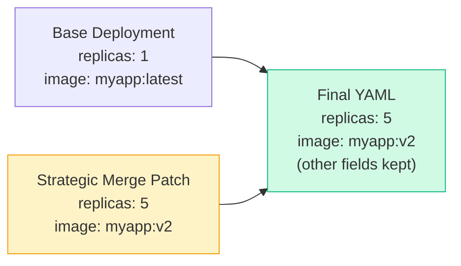

# Strategic Merge Patch


```yaml
# overlays/prod/kustomization.yaml
patches:
- path: increase-replicas.yaml      # reference a patch file
  target:
    kind: Deployment
    name: myapp
```

```yaml
# overlays/prod/increase-replicas.yaml (strategic merge patch)
apiVersion: apps/v1
kind: Deployment
metadata:
  name: myapp
spec:
  replicas: 5                        # only this field overridden
  template:
    spec:
      containers:
      - name: myapp
        resources:
          limits:
            memory: 512Mi            # add/override specific field
```
