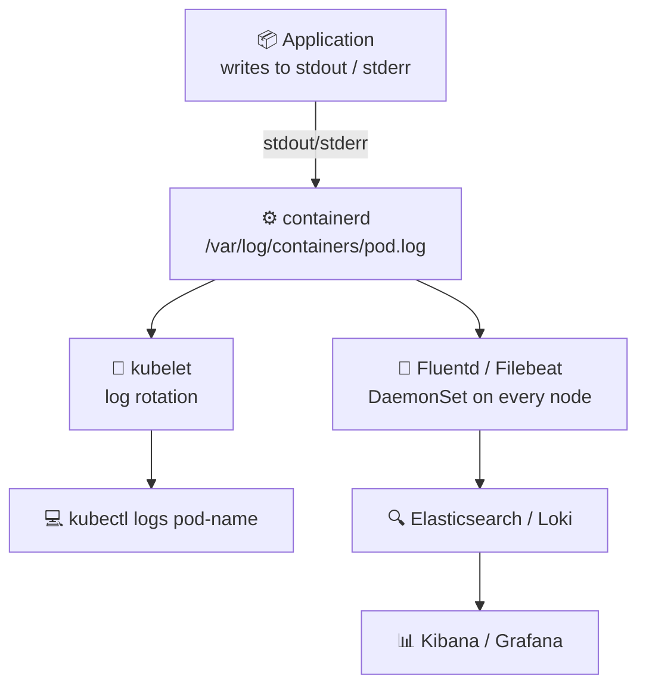
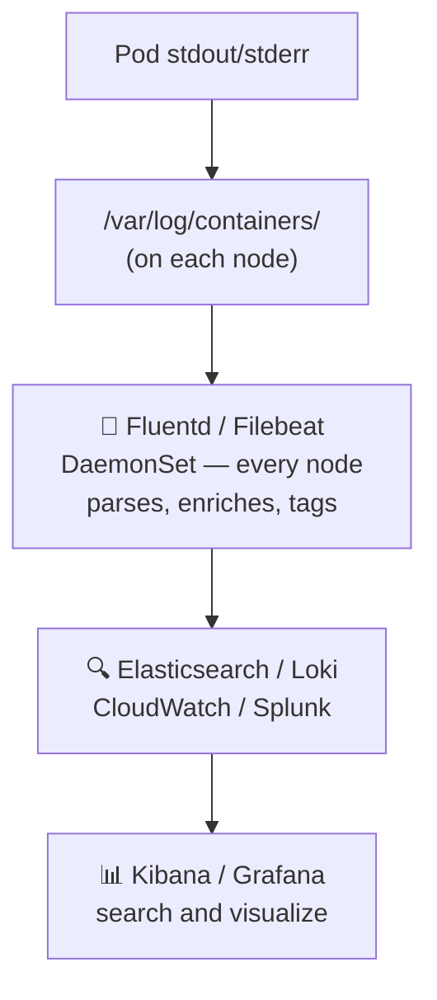

# Managing Application Logs

Kubernetes collects logs from container **stdout/stderr** automatically. Never write logs to files inside the container — they won't be accessible via `kubectl logs`.

## Log Flow



> **Key Rule:** Always write logs to **stdout/stderr** — Kubernetes captures them automatically. Never write to files inside the container.

## Single Container Pod Logs

```bash
# Basic
kubectl logs nginx-pod

# Follow / stream live
kubectl logs -f nginx-pod

# Last N lines
kubectl logs --tail=100 nginx-pod

# Logs from the last hour
kubectl logs --since=1h nginx-pod
kubectl logs --since=30m nginx-pod

# With timestamps
kubectl logs --timestamps nginx-pod

# Previous container instance (after crash / restart)
kubectl logs nginx-pod --previous
kubectl logs nginx-pod -p
```

## Multi-Container Pod Logs

```yaml
# multi-container-pod.yaml
apiVersion: v1
kind: Pod
metadata:
  name: web-with-sidecar
spec:
  containers:
  - name: web
    image: nginx:1.25
  - name: log-agent
    image: busybox
    command: ['sh', '-c', 'while true; do echo "[LOG] $(date)"; sleep 5; done']
```

```bash
# Must specify -c <container> for multi-container pods
kubectl logs web-with-sidecar -c web
kubectl logs web-with-sidecar -c log-agent

# Stream a specific container
kubectl logs -f web-with-sidecar -c web

# All containers at once
kubectl logs web-with-sidecar --all-containers=true
```

## Logs from Deployments and Labels

```bash
# By label selector
kubectl logs -l app=nginx
kubectl logs -l app=nginx --all-containers=true

# From all pods in a deployment
kubectl logs deployment/my-deployment
kubectl logs deployment/my-deployment -c nginx

# Previous crash logs
kubectl logs nginx-pod --previous
```

## Centralized Log Aggregation

For production, ship logs to a central store using a **Fluentd / Filebeat DaemonSet**:



```yaml
# Fluentd DaemonSet — collects logs from all nodes
apiVersion: apps/v1
kind: DaemonSet
metadata:
  name: fluentd
  namespace: kube-system
spec:
  selector:
    matchLabels:
      name: fluentd
  template:
    metadata:
      labels:
        name: fluentd
    spec:
      tolerations:
      - key: node-role.kubernetes.io/control-plane
        operator: Exists
        effect: NoSchedule
      containers:
      - name: fluentd
        image: fluent/fluentd-kubernetes-daemonset:v1-debian-elasticsearch
        env:
        - name: FLUENT_ELASTICSEARCH_HOST
          value: "elasticsearch.logging"
        - name: FLUENT_ELASTICSEARCH_PORT
          value: "9200"
        volumeMounts:
        - name: varlog
          mountPath: /var/log
        - name: containers
          mountPath: /var/lib/docker/containers
          readOnly: true
      volumes:
      - name: varlog
        hostPath:
          path: /var/log
      - name: containers
        hostPath:
          path: /var/lib/docker/containers
```

## Quick Reference

```bash
kubectl logs <pod>
kubectl logs <pod> -c <container>
kubectl logs <pod> -f
kubectl logs <pod> --tail=50
kubectl logs <pod> --since=1h
kubectl logs <pod> --previous
kubectl logs <pod> --timestamps
kubectl logs deployment/<name>
kubectl logs -l app=<label>
```
