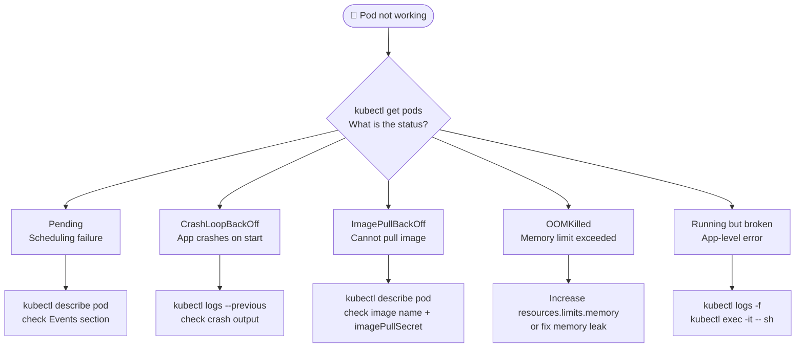

# Debugging Pods

Systematic debugging workflow for pods that are not working correctly.

## Decision Tree



## Common Pod Statuses

| Status | Meaning | First Command |
|---|---|---|
| `Pending` | Scheduler cannot place it | `kubectl describe pod` → Events |
| `CrashLoopBackOff` | Container starts and immediately exits | `kubectl logs --previous` |
| `ImagePullBackOff` | Cannot pull the container image | `kubectl describe pod` → check image + secret |
| `OOMKilled` | Container exceeded memory limit | Increase `resources.limits.memory` |
| `Running` | Container is up, app may have issues | `kubectl logs -f` or `kubectl exec` |
| `Terminating` | Pod is being deleted and is stuck | Check finalizers: `kubectl get pod -o yaml` |

## Full Debugging Sequence

```bash
# 1. Overview — what's wrong?
kubectl get pods -o wide

# 2. Describe — why is it in that state?
kubectl describe pod failing-pod
# Look at: Events section at the bottom

# 3. Last crash logs (CrashLoopBackOff)
kubectl logs failing-pod --previous

# 4. Live log stream (Running but broken)
kubectl logs failing-pod -f

# 5. Shell inside the container
kubectl exec -it failing-pod -- /bin/sh
kubectl exec -it failing-pod -- /bin/bash

# 6. Run a debug sidecar (if main container has no shell)
kubectl debug -it failing-pod --image=busybox --target=main-container
```

## Pending: Scheduling Failures

```bash
kubectl describe pod my-pod
# Events:
#   Warning  FailedScheduling  0/3 nodes are available:
#   3 Insufficient memory.
```

| Event Message | Cause | Fix |
|---|---|---|
| `Insufficient cpu/memory` | Not enough resources on any node | Reduce resource requests or scale nodes |
| `node(s) had taint` | Pod doesn't tolerate node taints | Add toleration to pod spec |
| `didn't match node selector` | No node matches nodeSelector | Fix nodeSelector or label a node |
| `Unschedulable` | Cluster autoscaler pending | Wait or manually scale |

## CrashLoopBackOff: Exit Code Meanings

```bash
kubectl describe pod my-pod | grep "Exit Code"
```

| Exit Code | Meaning |
|---|---|
| `0` | Clean exit — check why the app terminated normally |
| `1` | Application error |
| `137` | OOMKilled (out of memory) |
| `139` | Segmentation fault |
| `143` | SIGTERM received (graceful shutdown) |

## ImagePullBackOff

```bash
kubectl describe pod my-pod
# Events:
#   Warning  Failed  Failed to pull image "my-registry/app:v2":
#   rpc error: code = Unknown desc = ...

# Common causes:
# 1. Typo in image name or tag
# 2. Private registry needs imagePullSecret
# 3. Rate limiting (Docker Hub)
```

```yaml
# Fix: add imagePullSecret
spec:
  imagePullSecrets:
  - name: my-registry-secret
  containers:
  - name: app
    image: my-registry.io/app:v2
```

## Quick Reference

```bash
# Status overview
kubectl get pods -o wide
kubectl get events --sort-by='.lastTimestamp'

# Investigate
kubectl describe pod <name>
kubectl logs <pod>
kubectl logs <pod> --previous
kubectl logs <pod> -f

# Interactive debug
kubectl exec -it <pod> -- /bin/sh
kubectl debug -it <pod> --image=busybox

# Resource usage
kubectl top pod <name>
kubectl top nodes
```
