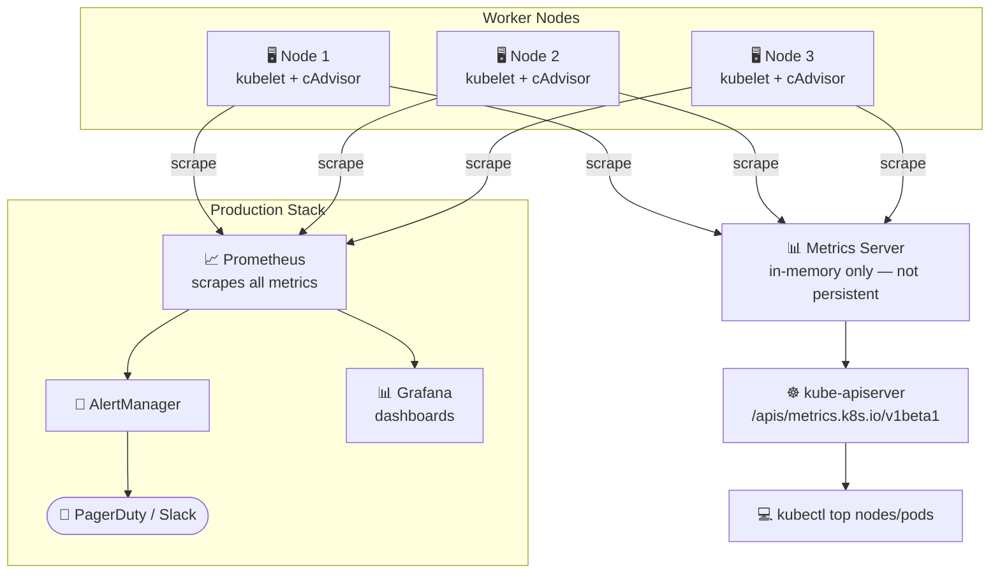
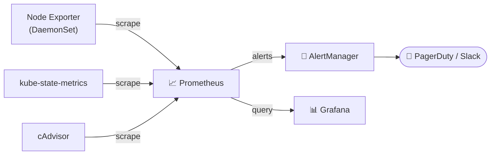

# Monitoring Overview

Kubernetes monitoring works in two layers: **lightweight in-cluster metrics** via the Metrics Server, and **full production observability** via Prometheus + Grafana.

## How Monitoring Works



## What to Monitor

| Resource | Key Metrics |
|---|---|
| Nodes | CPU, Memory, Disk usage |
| Pods | CPU, Memory per container |
| Control Plane | API server latency, etcd health |
| Workloads | Restart counts, OOMKilled events |

## Metrics Server

Metrics Server is the **official lightweight in-cluster solution**. It scrapes resource usage from kubelets (via cAdvisor) and exposes it through the API server. Data is **in-memory only** — not stored persistently.

```bash
# Deploy Metrics Server
kubectl apply -f https://github.com/kubernetes-sigs/metrics-server/releases/latest/download/components.yaml

# For kubeadm/self-hosted: add --kubelet-insecure-tls flag
kubectl patch deployment metrics-server -n kube-system \
  --type='json' \
  -p='[{"op":"add","path":"/spec/template/spec/containers/0/args/-","value":"--kubelet-insecure-tls"}]'

# Verify
kubectl get pods -n kube-system | grep metrics-server
kubectl top nodes   # wait ~60s for first data
```

## kubectl top

```bash
# Node resource usage
kubectl top nodes
# NAME       CPU(cores)   CPU%   MEMORY(bytes)   MEMORY%
# node01     350m         8%     1200Mi          60%

# Pod resource usage
kubectl top pods
kubectl top pods -n kube-system
kubectl top pods --sort-by=memory
kubectl top pods --sort-by=cpu
kubectl top pods --containers       # per-container breakdown
kubectl top pod nginx-pod
```

## Production Monitoring Stack

For persistent metrics, alerting, and dashboards use the **kube-prometheus-stack**:



```bash
# Install via Helm
helm repo add prometheus-community https://prometheus-community.github.io/helm-charts
helm install monitoring prometheus-community/kube-prometheus-stack \
  --namespace monitoring --create-namespace

# Access Grafana (default: admin / prom-operator)
kubectl port-forward svc/monitoring-grafana 3000:80 -n monitoring
```

## Quick Reference

```bash
kubectl top nodes
kubectl top pods
kubectl top pods --sort-by=cpu
kubectl top pods --sort-by=memory
kubectl top pods --containers
```
