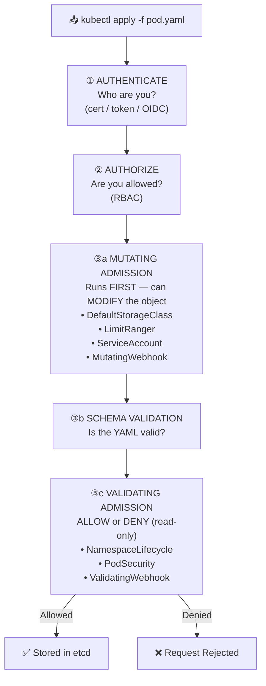

# Admission Controllers

Admission controllers intercept every API request **after authorization but before etcd persistence**. They can mutate (modify) or validate (allow/deny) any resource.

## Complete Request Flow



**Key rule:** Mutating webhooks always run BEFORE validating webhooks.

## Built-in Controllers

| Controller | Type | What It Does |
|---|---|---|
| `NamespaceLifecycle` | Validating | Blocks creation in non-existent/terminating namespaces |
| `DefaultStorageClass` | Mutating | Sets default StorageClass on PVCs |
| `LimitRanger` | Both | Injects defaults, enforces min/max from LimitRange |
| `ResourceQuota` | Validating | Rejects requests that exceed namespace quota |
| `ServiceAccount` | Mutating | Injects default SA + automounts token |
| `NodeRestriction` | Validating | Limits what kubelet can modify |
| `PodSecurity` | Validating | Enforces privileged/baseline/restricted standards |
| `AlwaysPullImages` | Mutating | Forces `imagePullPolicy: Always` |
| `MutatingAdmissionWebhook` | Mutating | Calls external HTTP endpoint to modify objects |
| `ValidatingAdmissionWebhook` | Validating | Calls external HTTP endpoint to allow/deny |

## Example 1 — View Enabled Plugins

```bash
cat /etc/kubernetes/manifests/kube-apiserver.yaml | grep admission
# --enable-admission-plugins=NodeRestriction,LimitRanger,DefaultStorageClass,ResourceQuota
```

## Example 2 — MutatingWebhookConfiguration (Sidecar Injector)

```yaml
apiVersion: admissionregistration.k8s.io/v1
kind: MutatingWebhookConfiguration
metadata:
  name: sidecar-injector
webhooks:
- name: sidecar-injector.company.com
  rules:
  - apiGroups: [""]
    apiVersions: ["v1"]
    operations: ["CREATE"]
    resources: ["pods"]
  namespaceSelector:
    matchLabels:
      inject-sidecar: "true"
  clientConfig:
    service:
      name: sidecar-injector-svc
      namespace: kube-system
      path: /mutate
    caBundle: <base64-ca>
  admissionReviewVersions: ["v1"]
  sideEffects: None
  failurePolicy: Fail    # Fail = reject pod if webhook is down
```

## Example 3 — ValidatingWebhookConfiguration

```yaml
apiVersion: admissionregistration.k8s.io/v1
kind: ValidatingWebhookConfiguration
metadata:
  name: no-privileged-pods
webhooks:
- name: no-privileged.company.com
  rules:
  - apiGroups: [""]
    apiVersions: ["v1"]
    operations: ["CREATE", "UPDATE"]
    resources: ["pods"]
  clientConfig:
    service:
      name: policy-webhook-svc
      namespace: kube-system
      path: /validate
    caBundle: <base64-ca>
  admissionReviewVersions: ["v1"]
  sideEffects: None
  failurePolicy: Ignore  # Ignore = allow if webhook is down
```

## failurePolicy

| `failurePolicy` | Webhook Down | When to Use |
|---|---|---|
| `Fail` | Request REJECTED | Security-critical webhooks |
| `Ignore` | Request ALLOWED | Non-critical / best-effort policies |

## OPA Gatekeeper Example

```yaml
# Kyverno policy — block :latest tag in production
apiVersion: kyverno.io/v1
kind: ClusterPolicy
metadata:
  name: disallow-latest-tag
spec:
  validationFailureAction: Enforce
  rules:
  - name: no-latest-tag
    match:
      any:
      - resources:
          kinds: [Pod]
          namespaces: [production]
    validate:
      message: "'latest' tag not allowed in production"
      pattern:
        spec:
          containers:
          - image: "!*:latest"
```

## Useful Commands

```bash
kubectl get mutatingwebhookconfigurations
kubectl get validatingwebhookconfigurations
kubectl describe mutatingwebhookconfiguration <name>
cat /etc/kubernetes/manifests/kube-apiserver.yaml | grep admission
```
