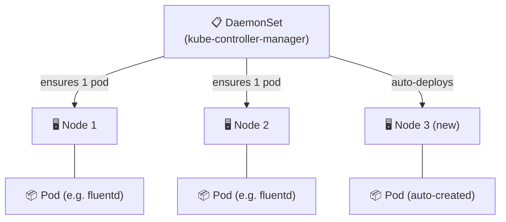

# DaemonSets

A DaemonSet ensures that **one pod runs on every node** (or a subset). When nodes are added, pods are automatically created. When nodes are removed, pods are garbage collected.



## Use Cases

| Use Case | Example Tools |
|---|---|
| Log collection | Fluentd, Filebeat, Promtail |
| Monitoring | Prometheus node-exporter, Datadog agent |
| Networking | kube-proxy, Calico, Cilium |
| Security | Falco, Sysdig |
| Storage | Ceph OSD agent |

## Example 1 — Fluentd Log Collector (including control-plane)

```yaml
apiVersion: apps/v1
kind: DaemonSet
metadata:
  name: fluentd-logging
  namespace: kube-system
spec:
  selector:
    matchLabels:
      name: fluentd-logging
  template:
    metadata:
      labels:
        name: fluentd-logging
    spec:
      tolerations:
      - key: node-role.kubernetes.io/control-plane   # also run on master
        operator: Exists
        effect: NoSchedule
      containers:
      - name: fluentd
        image: fluent/fluentd:v1.16
        resources:
          limits:
            memory: 200Mi
          requests:
            cpu: 100m
            memory: 200Mi
        volumeMounts:
        - name: varlog
          mountPath: /var/log
      volumes:
      - name: varlog
        hostPath:
          path: /var/log
```

## Example 2 — DaemonSet on a Subset of Nodes

```yaml
spec:
  template:
    spec:
      nodeSelector:
        disktype: ssd      # only SSD nodes get this pod
      containers:
      - name: storage-agent
        image: storage-agent:v2
```

## Example 3 — Creating from CLI

```bash
# Generate deployment YAML then convert to DaemonSet
kubectl create deployment node-monitor \
  --image=prom/node-exporter:latest \
  --dry-run=client -o yaml > daemonset.yaml

# Edit daemonset.yaml:
# 1. kind: Deployment  →  kind: DaemonSet
# 2. Remove: spec.replicas
# 3. Remove: spec.strategy

kubectl apply -f daemonset.yaml
kubectl get daemonsets -A
kubectl rollout status daemonset/node-monitor
```

## Static Pods vs DaemonSets

| Feature | Static Pods | DaemonSets |
|---|---|---|
| Managed by | kubelet | kube-controller-manager |
| Needs API server | No | Yes |
| kubectl visible | Yes (read-only mirror) | Yes (full control) |
| Runs on control-plane | Yes (by default) | Only with toleration |
| Use case | Control plane bootstrap | Node agents |
