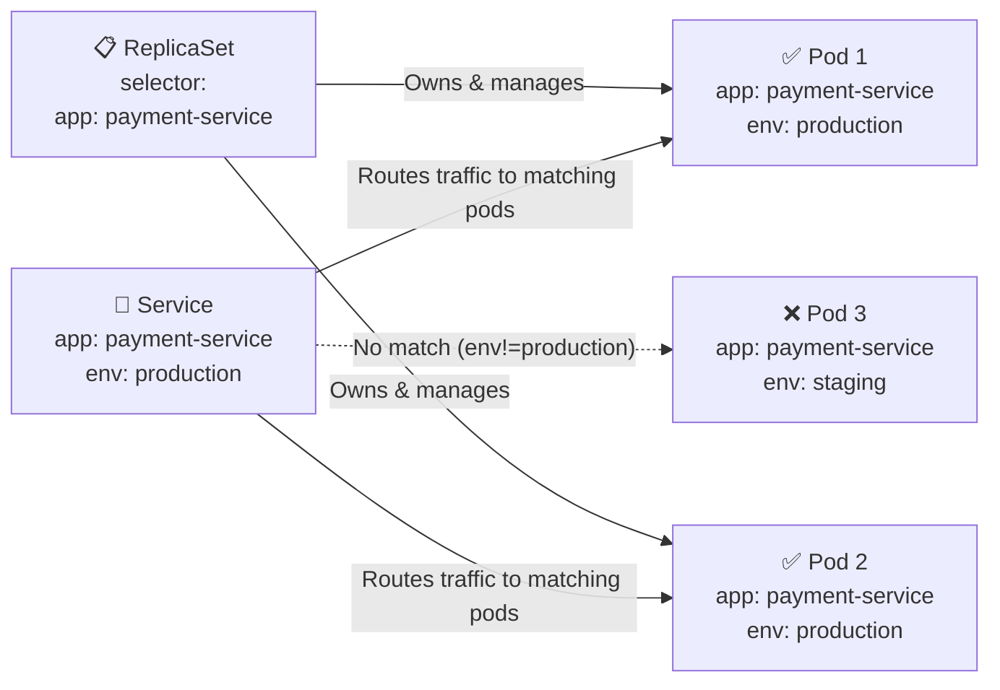

# Labels and Selectors

Labels are key-value pairs attached to Kubernetes objects. Selectors are how you query and filter those objects.



## Labels vs Annotations

| | Labels | Annotations |
|---|---|---|
| Purpose | Identify and select | Attach tool metadata |
| Queryable | Yes (`-l` flag) | No |
| Examples | `app=nginx`, `env=prod` | `build-id`, `git-commit` |

```yaml
metadata:
  labels:
    app: payment-service    # queryable — used for selection
    env: production
  annotations:
    git-commit: "a3f8d2c"          # not queryable, just metadata
    build-number: "2024-build-47"
    team-contact: "platform@company.com"
```

## Example 1 — Service Selecting Pods by Label

```yaml
# Service selects pods by label — NOT by pod name
apiVersion: v1
kind: Service
metadata:
  name: payment-svc
spec:
  selector:
    app: payment-service
    env: production        # only routes to pods with BOTH labels
  ports:
  - port: 80
    targetPort: 8080
```

```yaml
# Pod must have matching labels to receive traffic
apiVersion: v1
kind: Pod
metadata:
  name: payment-pod-1
  labels:
    app: payment-service
    env: production        # matches → gets traffic
    version: v2.1
spec:
  containers:
  - name: payment
    image: payment:v2.1
```

## Example 2 — ReplicaSet with Label Selector

```yaml
apiVersion: apps/v1
kind: ReplicaSet
metadata:
  name: payment-rs
spec:
  replicas: 3
  selector:
    matchLabels:
      app: payment-service   # RS owns pods with this label
  template:
    metadata:
      labels:
        app: payment-service  # pods created by RS get this label
    spec:
      containers:
      - name: payment
        image: payment:v2.1
```

## Example 3 — kubectl Label Filtering

```bash
# Show all labels
kubectl get pods --show-labels

# Equality filter
kubectl get pods -l env=production

# AND logic (both must match)
kubectl get pods -l env=production,tier=backend

# Set-based selectors
kubectl get pods -l 'env in (production, staging)'
kubectl get pods -l 'env notin (dev)'
kubectl get pods -l 'version'     # pods WITH the version label
kubectl get pods -l '!version'    # pods WITHOUT the version label

# Add / remove / overwrite
kubectl label pod payment-pod-1 canary=true
kubectl label pod payment-pod-1 canary-
kubectl label pod payment-pod-1 env=staging --overwrite
```

## Selector Types

| Selector Type | Syntax | Supported by |
|---|---|---|
| Equality-based | `key=value`, `key!=value` | Services, ReplicationControllers |
| Set-based | `key in (v1,v2)`, `key notin (v)` | ReplicaSets, Deployments, Jobs |
