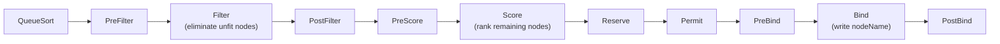

# Multiple Schedulers and Scheduler Profiles

Kubernetes supports running **multiple schedulers simultaneously**. Each pod chooses which scheduler handles it via `schedulerName`.

## Example 1 — Custom Scheduler as a Deployment

```yaml
apiVersion: apps/v1
kind: Deployment
metadata:
  name: my-custom-scheduler
  namespace: kube-system
spec:
  replicas: 1
  selector:
    matchLabels:
      component: my-custom-scheduler
  template:
    metadata:
      labels:
        component: my-custom-scheduler
    spec:
      serviceAccountName: my-custom-scheduler
      containers:
      - name: kube-scheduler
        image: registry.k8s.io/kube-scheduler:v1.29.0
        command:
        - kube-scheduler
        - --config=/etc/kubernetes/my-scheduler-config.yaml
        volumeMounts:
        - name: config
          mountPath: /etc/kubernetes/
      volumes:
      - name: config
        configMap:
          name: my-scheduler-config
```

## Scheduling Framework Pipeline



```yaml
apiVersion: v1
kind: ConfigMap
metadata:
  name: my-scheduler-config
  namespace: kube-system
data:
  my-scheduler-config.yaml: |
    apiVersion: kubescheduler.config.k8s.io/v1
    kind: KubeSchedulerConfiguration
    profiles:
    - schedulerName: my-custom-scheduler
    leaderElection:
      leaderElect: false   # false for single replica
```

## Example 3 — Pod Using Custom Scheduler

```yaml
apiVersion: v1
kind: Pod
metadata:
  name: nginx-custom-sched
spec:
  schedulerName: my-custom-scheduler   # default-scheduler if omitted
  containers:
  - name: nginx
    image: nginx:1.25
```

```bash
# Verify which scheduler picked it up
kubectl get events --sort-by='.lastTimestamp' | grep Scheduled

kubectl describe pod nginx-custom-sched | grep "Scheduler Name"
# Scheduler Name: my-custom-scheduler
```

## Scheduler Profiles

Run multiple scheduling profiles in a **single scheduler binary** — each profile has a different name and plugin configuration:

```yaml
apiVersion: kubescheduler.config.k8s.io/v1
kind: KubeSchedulerConfiguration
profiles:
# Profile 1: default behavior
- schedulerName: default-scheduler
  plugins:
    score:
      enabled:
      - name: NodeResourcesBalancedAllocation
        weight: 1

# Profile 2: least-allocated strategy, ignores taint scoring
- schedulerName: high-priority-scheduler
  plugins:
    score:
      disabled:
      - name: TaintToleration
      enabled:
      - name: NodeResourcesLeastAllocated
        weight: 2
```

## Extension Points Pipeline


| Extension Point | Purpose | Key Plugin |
|---|---|---|
| `Filter` | Eliminate unfit nodes | `NodeResourcesFit`, `TaintToleration` |
| `PostFilter` | Preemption if no node found | `DefaultPreemption` |
| `Score` | Rank remaining nodes | `NodeResourcesBalancedAllocation` |
| `Reserve` | Mark resources reserved | `VolumeBinding` |
| `Permit` | Approve / wait / deny | `Coscheduling` |
| `Bind` | Write `nodeName` to pod spec | `DefaultBinder` |
