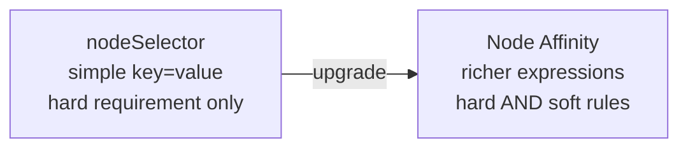
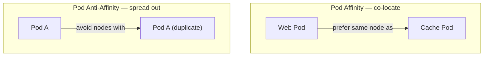

# Node Affinity & Pod Affinity

> Part of **05 📅 Scheduling** | CKA Chapter 5

Node Affinity lets you **attract pods to specific nodes** using labels. Pod Affinity/Anti-Affinity controls how pods relate to **each other**.

---

# Node Affinity vs nodeSelector



---

# Node Affinity Types

```yaml
spec:
  affinity:
    nodeAffinity:
      # HARD rule — must match
      requiredDuringSchedulingIgnoredDuringExecution:
        nodeSelectorTerms:
        - matchExpressions:
          - key: hardware
            operator: In
            values: [gpu, high-memory]
      # SOFT rule — prefer but not required
      preferredDuringSchedulingIgnoredDuringExecution:
      - weight: 80         # higher weight = stronger preference
        preference:
          matchExpressions:
          - key: zone
            operator: In
            values: [us-east-1a]
      - weight: 20
        preference:
          matchExpressions:
          - key: type
            operator: In
            values: [spot]
```

## Operators

```bash
# Label a node
kubectl label node node01 hardware=gpu
kubectl label node node01 zone=us-east-1a

# Verify label
kubectl get nodes --show-labels
kubectl get node node01 -o jsonpath='{.metadata.labels}'
```

---

# Pod Affinity & Anti-Affinity



```yaml
spec:
  affinity:
    podAffinity:
      requiredDuringSchedulingIgnoredDuringExecution:
      - labelSelector:
          matchLabels:
            app: cache
        topologyKey: kubernetes.io/hostname  # same node

    podAntiAffinity:
      preferredDuringSchedulingIgnoredDuringExecution:
      - weight: 100
        podAffinityTerm:
          labelSelector:
            matchLabels:
              app: web
          topologyKey: kubernetes.io/hostname  # spread across nodes
```

