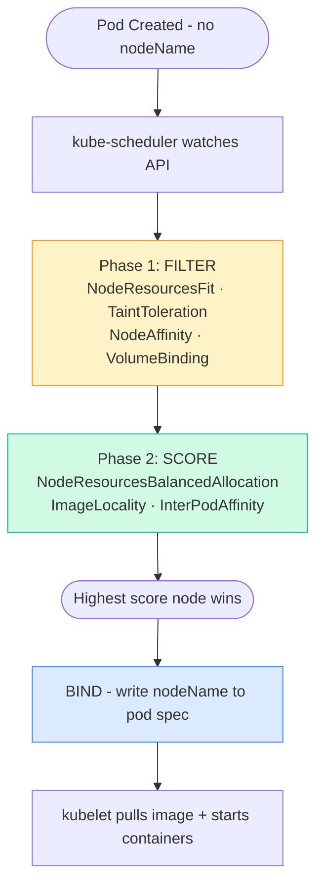

# Overview
This document covers every topic from the **Scheduling** section of the CKA course — how Kubernetes decides where pods run, and all the mechanisms to influence that decision. Every section includes **real-world examples** with full YAML and commands.

---

# Scheduling Overview

The **kube-scheduler** is responsible for assigning pods to nodes. When a pod is created without a `nodeName`, the scheduler picks the best node through a two-phase pipeline: **Filter → Score**.

---

# 1. Manual Scheduling
