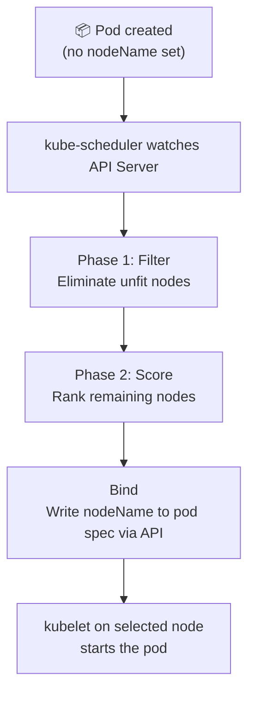

# Scheduling Overview

The **kube-scheduler** assigns pods to nodes through a two-phase pipeline: **Filter → Score**.



## How the Scheduler Works

Every pod spec has a `nodeName` field — empty by default. The scheduler fills it in. If you fill it yourself, the scheduler **skips that pod entirely**.

When a pod is created, the scheduler:
1. **Filters** nodes that cannot run the pod (insufficient resources, taints, affinity rules)
2. **Scores** remaining nodes using priority functions (resource balance, affinity weights)
3. **Binds** the pod to the highest-scoring node by writing the `nodeName` field

## Scheduler Pipeline Phases

| Phase | Purpose | Examples |
|---|---|---|
| `QueueSort` | Order pods in the scheduling queue | `PrioritySort` |
| `Filter` | Eliminate unfit nodes | `NodeResourcesFit`, `TaintToleration` |
| `Score` | Rank remaining nodes | `NodeResourcesBalancedAllocation` |
| `Reserve` | Mark resources reserved | `VolumeBinding` |
| `Permit` | Approve / wait / deny | `Coscheduling` |
| `Bind` | Write `nodeName` to pod spec | `DefaultBinder` |

## Diagnosing Scheduling Issues

```bash
# Why is a pod Pending?
kubectl describe pod <podname>
# Check Events section for FailedScheduling

# Is the scheduler running?
kubectl get pods -n kube-system | grep scheduler

# Scheduling events
kubectl get events --sort-by='.lastTimestamp' | grep -i scheduled

# Node resource usage
kubectl describe node <node> | grep -A10 'Allocated resources'
kubectl top nodes
```
