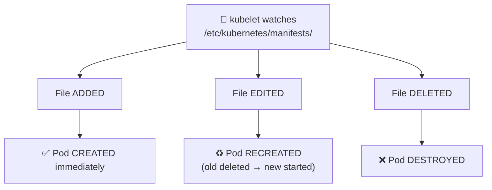

# Static Pods

Static Pods are managed **directly by kubelet** — no API server, scheduler, or controllers required. They are defined as YAML files in the `staticPodPath` directory.

## How It Works



Mirror pods (read-only copies) appear in `kubectl get pods` as `<podname>-<nodename>`. You **cannot** delete or edit them via kubectl — manage the YAML file on the node directly.

## Example 1 — Find staticPodPath

```bash
# Method 1: kubelet config file
cat /var/lib/kubelet/config.yaml | grep staticPodPath
# staticPodPath: /etc/kubernetes/manifests

# Method 2: kubelet process flags
ps aux | grep kubelet | grep -o '\-\-pod-manifest-path=[^ ]*'

# Method 3: kubeadm default — just check
ls /etc/kubernetes/manifests/
# etcd.yaml  kube-apiserver.yaml  kube-controller-manager.yaml  kube-scheduler.yaml
```

## Example 2 — Create a Static Pod

```bash
ssh node01

cat > /etc/kubernetes/manifests/static-web.yaml << 'EOF'
apiVersion: v1
kind: Pod
metadata:
  name: static-web
  labels:
    role: static-web
spec:
  containers:
  - name: nginx
    image: nginx:1.25
    ports:
    - containerPort: 80
EOF

# kubelet detects and creates it automatically
# Visible from control plane as: static-web-node01
kubectl get pods -A | grep static-web
```

## Example 3 — Modify / Delete a Static Pod

```bash
# CANNOT edit via kubectl (changes are ignored or overwritten)
kubectl edit pod static-web-node01   # changes discarded

# MUST edit the file on the node directly
ssh node01
vi /etc/kubernetes/manifests/static-web.yaml  # kubelet auto-recreates

# To DELETE: remove the file
rm /etc/kubernetes/manifests/static-web.yaml  # pod destroyed

# kubectl delete on a mirror pod is IGNORED — kubelet recreates it
kubectl delete pod static-web-node01  # pod comes back!
```

## Real-World Use: Control Plane Bootstrap

The control plane components in a kubeadm cluster are themselves Static Pods:

```bash
ls /etc/kubernetes/manifests/
# etcd.yaml
# kube-apiserver.yaml
# kube-controller-manager.yaml
# kube-scheduler.yaml
```

This is why the control plane can recover even if etcd or the API server crashes — kubelet restarts them independently.

## Static Pods vs DaemonSets

| | Static Pods | DaemonSets |
|---|---|---|
| Managed by | kubelet | kube-controller-manager |
| Needs API server | No | Yes |
| kubectl visible | Yes (read-only mirror) | Yes (full control) |
| Configuration | YAML file on node | Kubernetes API object |
| Use case | Control plane bootstrap | Node agents |
