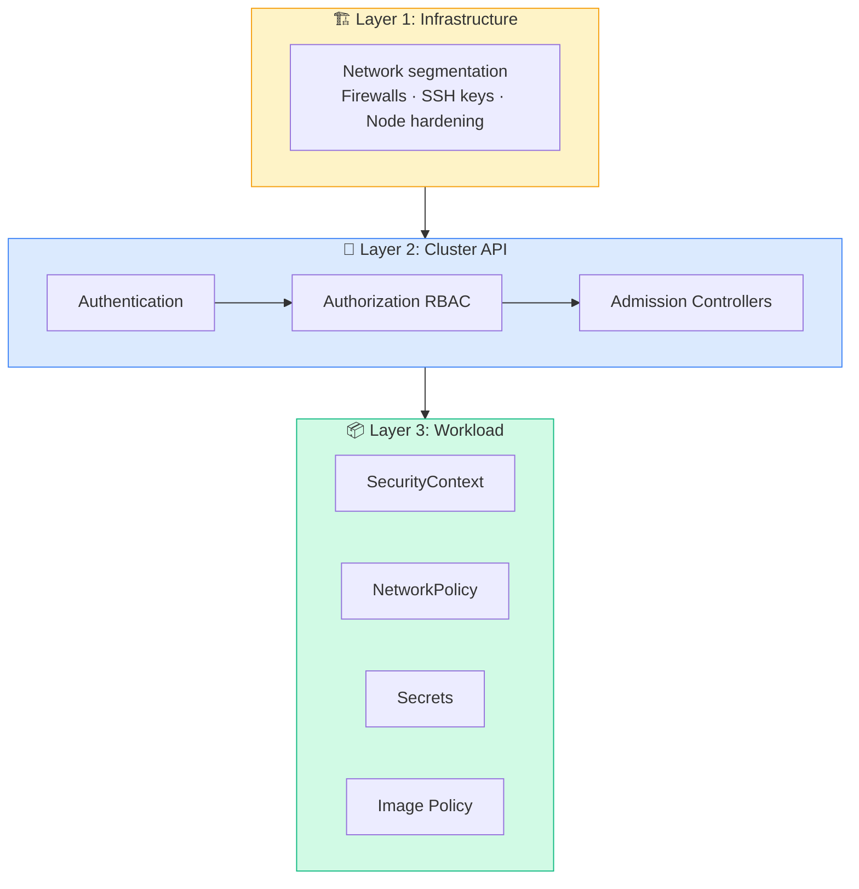
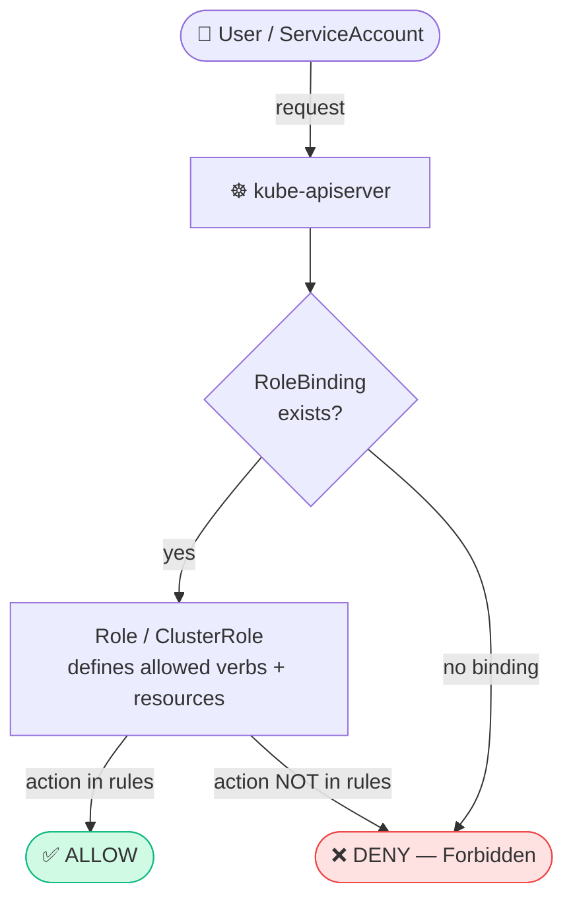
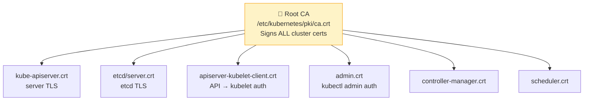
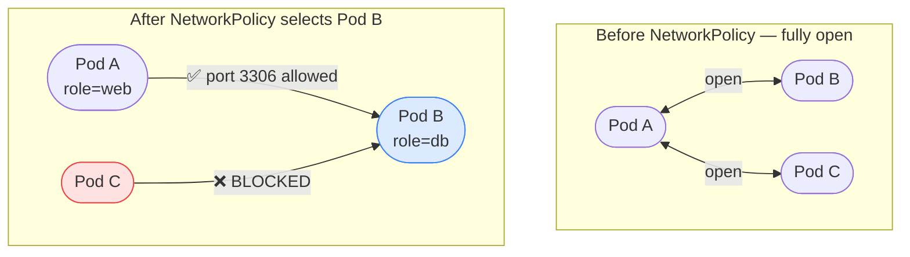
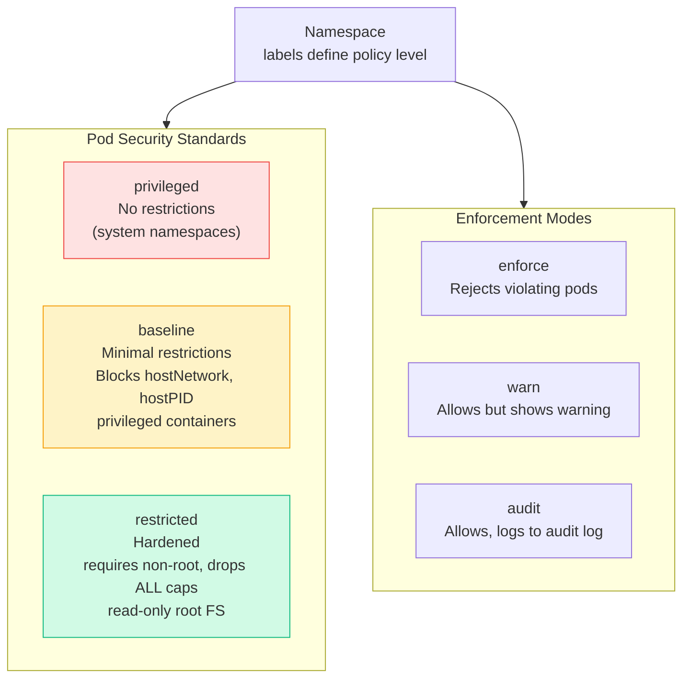
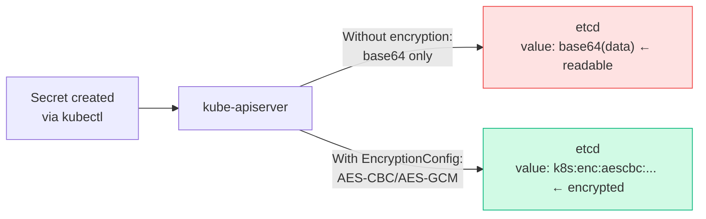
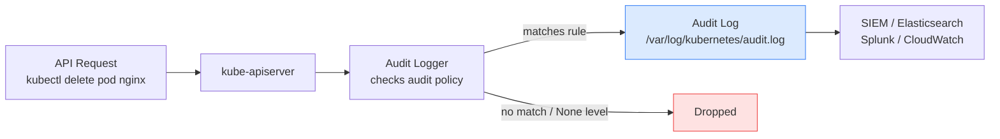
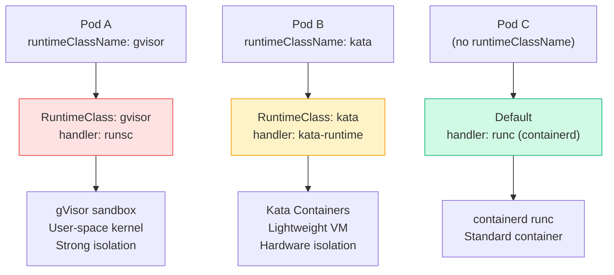
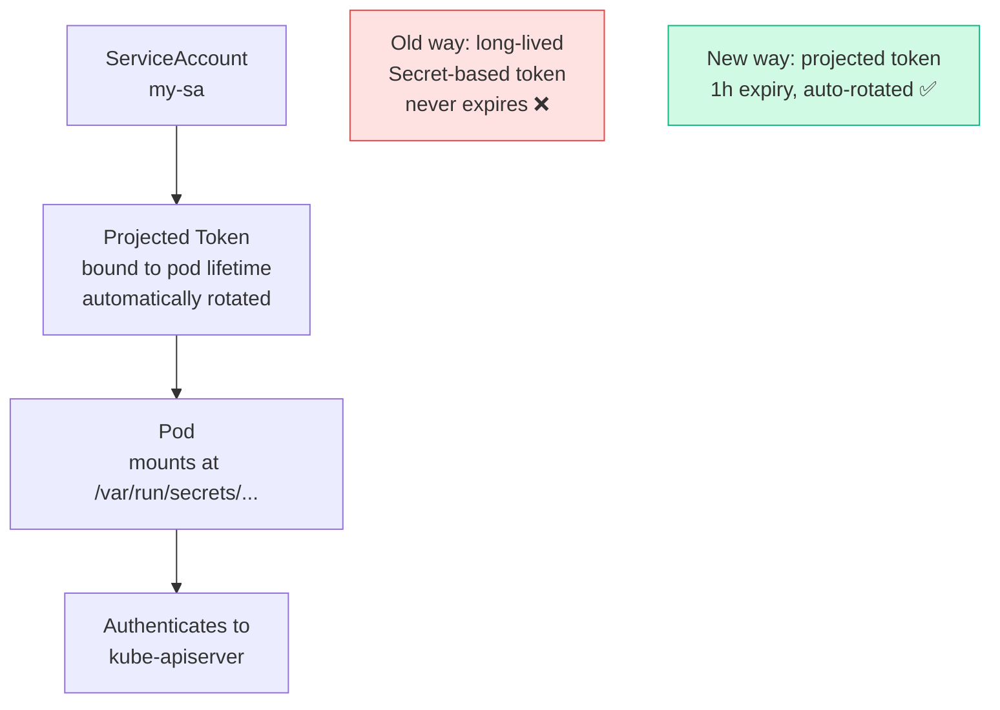

---

# Flow: Kubernetes Security Layers

```javascript
┌─────────────────────────────────────────────────────┐
│              KUBERNETES SECURITY LAYERS                │
│                                                       │
│  Layer 1: Infrastructure Security                     │
│    Network segmentation, firewall, SSH keys           │
│                      │                               │
│  Layer 2: Cluster Security (kube-apiserver)           │
│    ┌──────────────────────────────────────┐           │
│    │ Authentication → Authorization → Admission │           │
│    └──────────────────────────────────────┘           │
│                      │                               │
│  Layer 3: Application Security                        │
│    SecurityContext, NetworkPolicy, Secrets             │
│    RBAC for ServiceAccounts, Image scanning           │
└─────────────────────────────────────────────────────┘
```

---

# 1. Authentication

## Who Can Access the Cluster?

```javascript
┌────────────────────────────────────────────────┐
│           AUTHENTICATION METHODS                       │
│                                                       │
│  Humans                Machines                       │
│  ┌───────────┐        ┌───────────┐             │
│  │ Admins    │        │ Bots/Apps │             │
│  │ Devs      │        │ Services  │             │
│  └───────────┘        └───────────┘             │
│       │                     │                   │
│  Client Certificates    ServiceAccount Tokens   │
│  Static Token Files     OIDC Tokens             │
│  OIDC                   Webhook                 │
└────────────────────────────────────────────────┘
```

> Kubernetes does NOT manage human users natively — it relies on external mechanisms (certs, OIDC, LDAP). **ServiceAccounts** are the native identity for in-cluster workloads.

---

# 2. TLS in Kubernetes

## Certificate Flow

```javascript
┌─────────────────────────────────────────────────────┐
│               TLS CERTIFICATE MAP                      │
│                                                       │
│  ROOT CA (/etc/kubernetes/pki/ca.crt)                 │
│  signs all cluster certificates                       │
│       │                                               │
│  ┌────┴──────────────────────────────────────┐     │
│  │         Component Certificates            │     │
│  │                                           │     │
│  │  kube-apiserver.crt  (server cert)         │     │
│  │  etcd-server.crt     (etcd server)         │     │
│  │  kubelet.crt         (each node)           │     │
│  │  admin.crt           (admin user)          │     │
│  │  kube-scheduler.crt  (scheduler client)    │     │
│  │  controller-mgr.crt  (ctrl-mgr client)     │     │
│  └──────────────────────────────────────────┘     │
└─────────────────────────────────────────────────────┘
```

```bash
# View certificate details
openssl x509 -in /etc/kubernetes/pki/apiserver.crt -text -noout | grep -E 'Subject|Issuer|Not After'

# Check all certificates expiry
kubeadm certs check-expiration

# Renew all certificates
kubeadm certs renew all

# View certificate from kubeconfig
kubectl config view --raw | grep certificate-authority-data
```

---

# 3. kubeconfig

## kubeconfig Structure

```javascript
┌──────────────────────────────────────────────────┐
│                 KUBECONFIG FILE                        │
│                                                       │
│  clusters:          ← WHERE to connect (API server URL)│
│    - name: prod-cluster                               │
│      server: https://1.2.3.4:6443                     │
│      certificate-authority: /path/ca.crt              │
│                                                       │
│  users:             ← WHO is connecting               │
│    - name: admin-user                                 │
│      client-certificate: /path/admin.crt              │
│      client-key: /path/admin.key                      │
│                                                       │
│  contexts:          ← WHO connects to WHERE            │
│    - name: admin@prod                                 │
│      cluster: prod-cluster                            │
│      user: admin-user                                 │
│      namespace: production                            │
│                                                       │
│  current-context: admin@prod                          │
└──────────────────────────────────────────────────┘
```

```bash
# View current kubeconfig
kubectl config view
kubectl config view --raw   # show cert data

# List contexts
kubectl config get-contexts

# Switch context
kubectl config use-context admin@prod

# Set default namespace for current context
kubectl config set-context --current --namespace=production

# Use specific kubeconfig file
kubectl get pods --kubeconfig=/path/to/config
export KUBECONFIG=/path/to/config

# Merge multiple kubeconfigs
export KUBECONFIG=~/.kube/config:~/.kube/dev-config
kubectl config view --flatten > ~/.kube/merged-config
```

---

# 4. RBAC — Role-Based Access Control

## RBAC Flow

```javascript
┌──────────────────────────────────────────────────┐
│                   RBAC FLOW                           │
│                                                      │
│  User/SA ──makes request──► kube-apiserver            │
│                                   │                  │
│                          checks RoleBinding           │
│                                   │                  │
│                 ┌──────────────┴───────────┐        │
│                 │              RoleBinding           │
│                 │          (binds user to role)      │
│                 ▼                   │                │
│              Role                   │                │
│    (rules: what is allowed)         │                │
│    - apiGroups: [""]               │                │
│      resources: ["pods"]           │                │
│      verbs: ["get","list"]         │                │
│                 │                  │                │
│           ALLOW or DENY            │                │
└──────────────────────────────────────────────────┘

Namespaced:                Non-Namespaced:
  Role                       ClusterRole
  RoleBinding                ClusterRoleBinding
```

## Role & RoleBinding Examples

```yaml
# Role — namespaced, defines WHAT is allowed
apiVersion: rbac.authorization.k8s.io/v1
kind: Role
metadata:
  name: pod-reader
  namespace: default
rules:
- apiGroups: [""]              # "" = core API group
  resources: ["pods", "pods/log"]
  verbs: ["get", "list", "watch"]
- apiGroups: ["apps"]
  resources: ["deployments"]
  verbs: ["get", "list"]
```

```yaml
# RoleBinding — binds user/group/SA to a Role
apiVersion: rbac.authorization.k8s.io/v1
kind: RoleBinding
metadata:
  name: read-pods
  namespace: default
subjects:
- kind: User
  name: jane
  apiGroup: rbac.authorization.k8s.io
- kind: ServiceAccount
  name: monitoring-sa
  namespace: monitoring
roleRef:
  kind: Role
  name: pod-reader
  apiGroup: rbac.authorization.k8s.io
```

```yaml
# ClusterRole — cluster-wide (nodes, PVs, namespaces)
apiVersion: rbac.authorization.k8s.io/v1
kind: ClusterRole
metadata:
  name: cluster-admin-readonly
rules:
- apiGroups: [""]
  resources: ["nodes", "persistentvolumes", "namespaces"]
  verbs: ["get", "list", "watch"]
- apiGroups: ["*"]
  resources: ["*"]
  verbs: ["get", "list", "watch"]
```

```bash
# Create imperative
kubectl create role pod-reader --verb=get,list,watch --resource=pods -n default
kubectl create rolebinding read-pods --role=pod-reader --user=jane -n default
kubectl create clusterrole cluster-reader --verb=get,list,watch --resource='*.*'
kubectl create clusterrolebinding cluster-reader-binding --clusterrole=cluster-reader --user=jane

# Check access
kubectl auth can-i get pods --as=jane
kubectl auth can-i get pods --as=jane -n production
kubectl auth can-i '*' '*'   # am I a cluster-admin?

# Check what a user can do
kubectl auth can-i --list --as=jane -n default
```

---

# 5. SecurityContext

## SecurityContext Flow

```javascript
┌──────────────────────────────────────────────────┐
│             SECURITY CONTEXT LEVELS                   │
│                                                       │
│  Pod-level securityContext (applies to all containers)│
│  spec:
│    securityContext:
│      runAsUser: 1000          ← UID to run as         │
│      runAsGroup: 3000         ← GID                   │
│      fsGroup: 2000            ← Volume ownership      │
│      runAsNonRoot: true       ← refuse root           │
│                                                       │
│  Container-level securityContext (overrides pod level) │
│    securityContext:                                   │
│      allowPrivilegeEscalation: false                  │
│      readOnlyRootFilesystem: true                     │
│      capabilities:                                    │
│        add: ["NET_ADMIN", "SYS_TIME"]                 │
│        drop: ["ALL"]                                  │
└──────────────────────────────────────────────────┘
```

```yaml
apiVersion: v1
kind: Pod
metadata:
  name: secure-pod
spec:
  securityContext:
    runAsUser: 1000
    runAsGroup: 3000
    fsGroup: 2000
    runAsNonRoot: true
  containers:
  - name: app
    image: myapp:v2
    securityContext:
      allowPrivilegeEscalation: false
      readOnlyRootFilesystem: true
      capabilities:
        drop: ["ALL"]
        add: ["NET_BIND_SERVICE"]
```

---

# 6. Network Policies

## Network Policy Flow

```javascript
┌──────────────────────────────────────────────────┐
│              NETWORK POLICY MODEL                     │
│                                                      │
│  DEFAULT: all pods can talk to all pods              │
│                                                      │
│  Once a NetworkPolicy SELECTS a pod:                 │
│    ALL traffic not explicitly allowed is BLOCKED     │
│                                                      │
│  ┌────────────────────────────────────────────┐      │
│  │  [web] ──allow:3306──► [db]                  │      │
│  │   web pod only allowed to reach db on 3306  │      │
│  │   All other ingress to db is BLOCKED        │      │
│  └────────────────────────────────────────────┘      │
└──────────────────────────────────────────────────┘
```

```yaml
# Allow only web pods to reach db on port 3306
apiVersion: networking.k8s.io/v1
kind: NetworkPolicy
metadata:
  name: db-policy
  namespace: production
spec:
  podSelector:
    matchLabels:
      role: db              # this policy applies to db pods
  policyTypes:
  - Ingress
  - Egress
  ingress:
  - from:
    - podSelector:
        matchLabels:
          role: web         # only allow from web pods
      namespaceSelector:
        matchLabels:
          project: myapp    # only from this namespace
    ports:
    - protocol: TCP
      port: 3306
  egress:
  - to:
    - ipBlock:
        cidr: 10.0.0.0/24  # allow egress to backup server
    ports:
    - protocol: TCP
      port: 5432
```

```bash
kubectl get networkpolicies -A
kubectl describe networkpolicy db-policy -n production
```

---

# Quick Reference

```bash
# RBAC
kubectl create role <name> --verb=get,list --resource=pods
kubectl create rolebinding <name> --role=<role> --user=<user>
kubectl create clusterrole <name> --verb='*' --resource='*.*'
kubectl create clusterrolebinding <name> --clusterrole=<role> --user=<user>
kubectl auth can-i get pods --as=<user>
kubectl auth can-i --list --as=<user>

# Certificates
kubeadm certs check-expiration
kubeadm certs renew all
openssl x509 -in <cert.crt> -text -noout

# kubeconfig
kubectl config get-contexts
kubectl config use-context <context>
kubectl config set-context --current --namespace=<ns>
```

> 📚 **Ref:** [RBAC](https://kubernetes.io/docs/reference/access-authn-authz/rbac/) | [Network Policies](https://kubernetes.io/docs/concepts/services-networking/network-policies/) | [SecurityContext](https://kubernetes.io/docs/tasks/configure-pod-container/security-context/)

[Table Placeholder]

## 🔄 Authentication Methods

[Table Placeholder]

> ⚠️ Kubernetes does **not** manage human user accounts natively. Users are represented by certificates or OIDC claims. Only `ServiceAccounts` are native Kubernetes objects.

## 🔄 TLS Certificate Map

[Table Placeholder]

## 🔄 RBAC Flow

[Table Placeholder]

## 🔄 NetworkPolicy Model

[Table Placeholder]

> 📌 NetworkPolicy requires a CNI plugin that supports it — **Calico, Cilium, Weave**. Flannel does NOT enforce NetworkPolicy by default.

---

# 🧩 Mermaid Diagrams

## Kubernetes Security Layers



## RBAC Flow



## TLS Certificate Map



## NetworkPolicy — Before vs After



---

# 5. Pod Security Admission (PSA)

Replaced PodSecurityPolicy (removed in v1.25). Enforces **Pod Security Standards** via namespace labels — no webhooks needed.



```bash
# Label a namespace to enforce the restricted standard
kubectl label namespace production \
  pod-security.kubernetes.io/enforce=restricted \
  pod-security.kubernetes.io/enforce-version=v1.31 \
  pod-security.kubernetes.io/warn=restricted \
  pod-security.kubernetes.io/audit=restricted

# Test: try creating a privileged pod in the namespace
kubectl run priv-pod --image=nginx \
  --overrides='{"spec":{"containers":[{"name":"nginx","image":"nginx","securityContext":{"privileged":true}}]}}' \
  -n production
# Error: pods "priv-pod" is forbidden:
# violates PodSecurity "restricted:v1.31": privileged (container "nginx")

# Correct pod for restricted namespace
kubectl run safe-pod --image=nginx -n production
# (needs securityContext in practice — see below)
```

```yaml
# Pod that passes "restricted" PSA
apiVersion: v1
kind: Pod
metadata:
  name: restricted-pod
  namespace: production
spec:
  securityContext:
    runAsNonRoot: true
    runAsUser: 1000
    seccompProfile:
      type: RuntimeDefault
  containers:
  - name: app
    image: nginx:1.25
    securityContext:
      allowPrivilegeEscalation: false
      readOnlyRootFilesystem: true
      capabilities:
        drop: ["ALL"]
```

[Table Placeholder]

---

# 6. etcd Encryption at Rest

Secrets stored in etcd are base64-encoded by default — **not encrypted**. Enable encryption to protect them from etcd data access.



```yaml
# /etc/kubernetes/enc/encryption-config.yaml
apiVersion: apiserver.config.k8s.io/v1
kind: EncryptionConfiguration
resources:
- resources:
  - secrets
  - configmaps        # optionally encrypt configmaps too
  providers:
  - aescbc:           # AES-CBC encryption (first = used for writes)
      keys:
      - name: key1
        secret: c2VjcmV0LWtleS0xMjM0NTY3ODkwMTIzNDU2  # base64(32-byte key)
  - identity: {}      # fallback — reads unencrypted existing secrets
```

```bash
# 1. Create the encryption config
mkdir -p /etc/kubernetes/enc
# Generate a 32-byte random key and base64 encode it
head -c 32 /dev/urandom | base64

# 2. Reference it in kube-apiserver
vi /etc/kubernetes/manifests/kube-apiserver.yaml
# Add flag:
# --encryption-provider-config=/etc/kubernetes/enc/encryption-config.yaml
# Add volume + volumeMount for /etc/kubernetes/enc/

# 3. Restart API server (it's a static pod — edit triggers restart)

# 4. Re-encrypt ALL existing secrets
kubectl get secrets --all-namespaces -o json | kubectl replace -f -

# 5. Verify a secret is encrypted in etcd
ETCDCTL_API=3 etcdctl get /registry/secrets/default/my-secret \
  --endpoints=https://127.0.0.1:2379 \
  --cacert=/etc/kubernetes/pki/etcd/ca.crt \
  --cert=/etc/kubernetes/pki/etcd/server.crt \
  --key=/etc/kubernetes/pki/etcd/server.key \
  | hexdump -C | head
# Should show: k8s:enc:aescbc:v1:key1:...  (not readable plaintext)
```

---

# 7. Audit Logging

Records every API request — **who did what, when**. Essential for compliance and security investigation.



```yaml
# /etc/kubernetes/audit/policy.yaml
apiVersion: audit.k8s.io/v1
kind: Policy
rules:
# Log all secret access at Metadata level (no body)
- level: Metadata
  resources:
  - group: ""
    resources: ["secrets"]

# Log pod creation at RequestResponse level (full body)
- level: RequestResponse
  verbs: ["create", "delete"]
  resources:
  - group: ""
    resources: ["pods"]

# Skip noisy health checks
- level: None
  users: ["system:kube-proxy"]
  verbs: ["watch"]
  resources:
  - group: ""
    resources: ["endpoints", "services"]

# Default: log everything else at Metadata
- level: Metadata
```

[Table Placeholder]

```bash
# Enable in kube-apiserver
vi /etc/kubernetes/manifests/kube-apiserver.yaml
# Add flags:
# --audit-policy-file=/etc/kubernetes/audit/policy.yaml
# --audit-log-path=/var/log/kubernetes/audit.log
# --audit-log-maxage=30
# --audit-log-maxbackup=3
# --audit-log-maxsize=100

# View audit logs
tail -f /var/log/kubernetes/audit.log | jq .
# {"kind":"Event","apiVersion":"audit.k8s.io/v1","level":"Metadata",
#  "user":{"username":"admin"},"verb":"delete","objectRef":{"resource":"pods",...}}
```

---

# 8. RuntimeClass

Select a **different container runtime** per pod — useful for workloads needing stronger isolation (gVisor, Kata Containers).



```yaml
# Define a RuntimeClass (admin task — requires node setup)
apiVersion: node.k8s.io/v1
kind: RuntimeClass
metadata:
  name: gvisor
handler: runsc                  # matches containerd runtime handler name
scheduling:
  nodeSelector:
    sandbox.io/runtime: gvisor  # only schedule on nodes with gVisor installed
```

```yaml
# Use RuntimeClass in a Pod
apiVersion: v1
kind: Pod
metadata:
  name: sandboxed-app
spec:
  runtimeClassName: gvisor      # use gVisor instead of runc
  containers:
  - name: app
    image: myapp:v2
```

```bash
kubectl get runtimeclass
kubectl describe runtimeclass gvisor
```

---

# 9. ServiceAccount Token Projection

Modern approach to ServiceAccount tokens — **bound tokens** with expiry, audience, and volume projection (replaces auto-mounted tokens).



```yaml
# Projected ServiceAccount token with custom expiry and audience
apiVersion: v1
kind: Pod
metadata:
  name: myapp
spec:
  serviceAccountName: my-sa
  automountServiceAccountToken: false   # disable default mount
  containers:
  - name: app
    image: myapp:v2
    volumeMounts:
    - name: token-vol
      mountPath: /var/run/secrets/tokens
      readOnly: true
  volumes:
  - name: token-vol
    projected:
      sources:
      - serviceAccountToken:
          path: token
          expirationSeconds: 3600          # 1 hour (min 600s)
          audience: "https://api.myapp.com" # restrict to this audience
      - configMap:
          name: kube-root-ca.crt
          items:
          - key: ca.crt
            path: ca.crt
```

```bash
# Read token from inside the pod
kubectl exec myapp -- cat /var/run/secrets/tokens/token

# Disable auto-mount cluster-wide for a ServiceAccount
kubectl patch serviceaccount default \
  -p '{"automountServiceAccountToken": false}'

# Check what token is mounted
kubectl exec myapp -- ls /var/run/secrets/kubernetes.io/serviceaccount/
```
