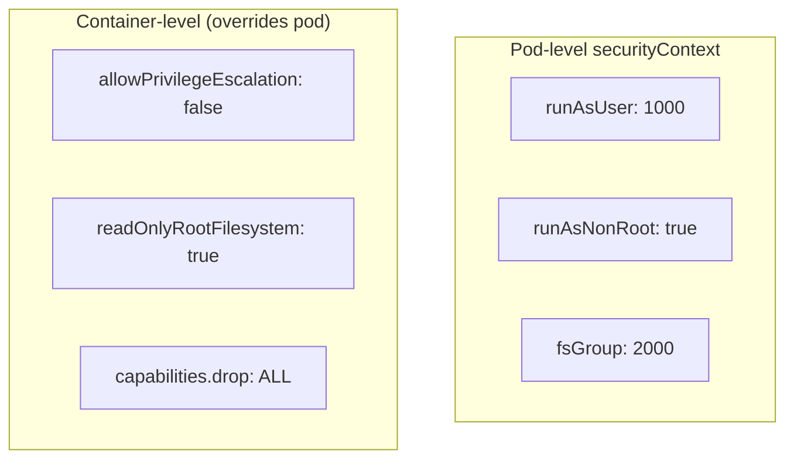
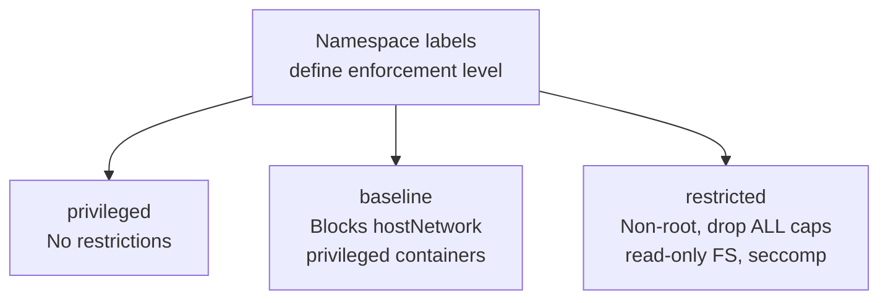

# SecurityContext & Pod Security Admission

> Part of **09 🔒 Security** | CKA Chapter 9

---

# SecurityContext — Harden Containers



```yaml
apiVersion: v1
kind: Pod
spec:
  securityContext:
    runAsUser: 1000
    runAsGroup: 3000
    fsGroup: 2000
    runAsNonRoot: true
  containers:
  - name: app
    image: myapp:v2
    securityContext:
      allowPrivilegeEscalation: false
      readOnlyRootFilesystem: true
      capabilities:
        drop: ["ALL"]
        add: ["NET_BIND_SERVICE"]
```

---

# Pod Security Admission (PSA)

Enforces **Pod Security Standards** via namespace labels — no webhooks needed. Replaced PodSecurityPolicy (removed v1.25).



```bash
# Enforce restricted standard on a namespace
kubectl label namespace production \
  pod-security.kubernetes.io/enforce=restricted \
  pod-security.kubernetes.io/enforce-version=v1.31 \
  pod-security.kubernetes.io/warn=restricted \
  pod-security.kubernetes.io/audit=restricted

# Mode: enforce=hard block | warn=allow+warn | audit=allow+log
```

