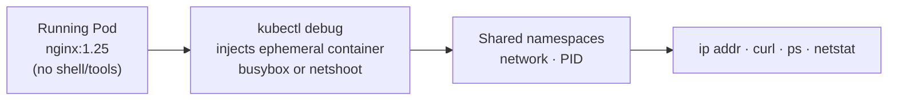

# Ephemeral Containers & kubectl debug

> Part of **15 🔍 Troubleshooting** | CKA Chapter 15

Ephemeral containers let you inject a **debug container into a running pod** without restarting it — great for distroless or minimal images with no shell.

---



```bash
# Debug a pod (inject ephemeral container)
kubectl debug -it nginx-pod --image=busybox:1.28 --target=nginx
kubectl debug -it nginx-pod --image=nicolaka/netshoot --target=nginx -- bash

# Inside: same network as pod
ip addr
curl localhost:80
ss -tlnp

# Debug a NODE (creates privileged pod on that node)
kubectl debug node/node01 -it --image=ubuntu:22.04
# Inside:
chroot /host           # access host filesystem
crictl ps              # containers on node
journalctl -u kubelet

# Copy a broken pod with different image
kubectl debug broken-pod \
  --copy-to=broken-pod-debug \
  --image=busybox:1.28
```

```bash
# Check ephemeral containers
kubectl describe pod nginx-pod | grep -A5 "Ephemeral Containers"
kubectl get pod nginx-pod -o jsonpath='{.spec.ephemeralContainers}'
```

