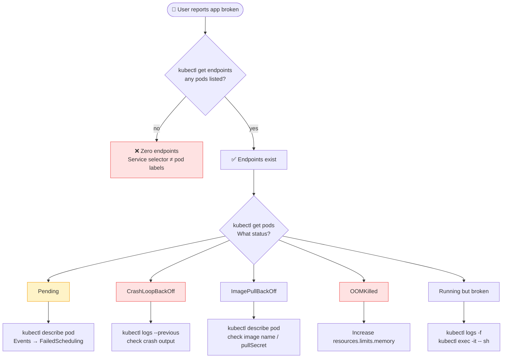
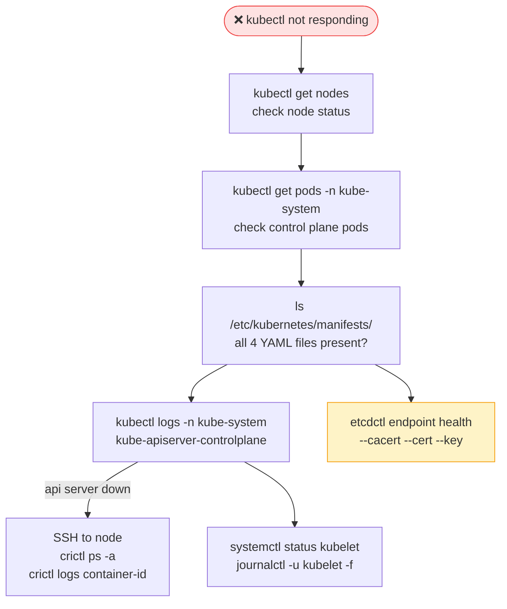
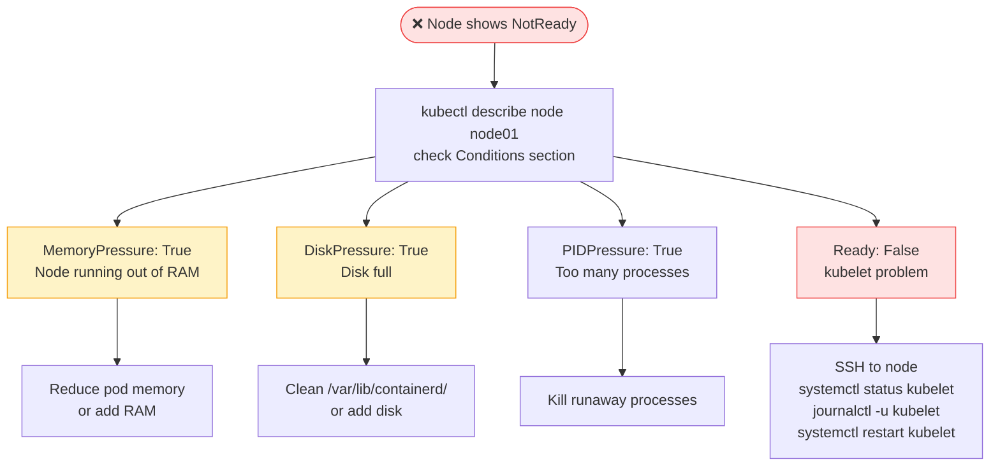
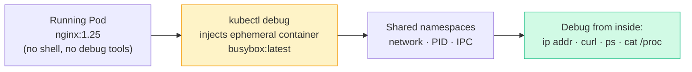
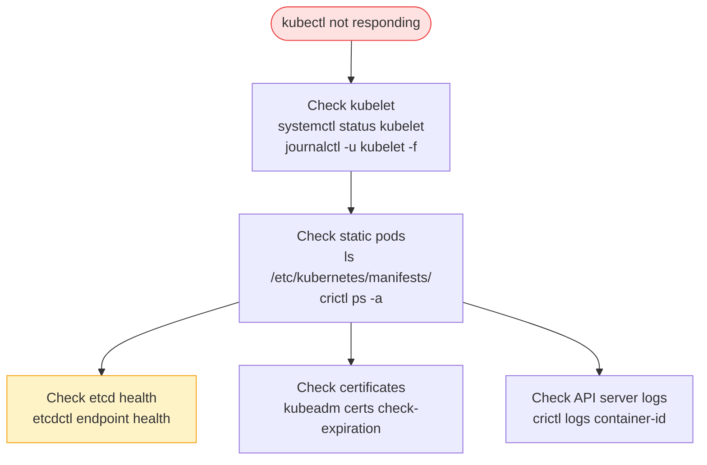

---

# 1. Application Failure Troubleshooting

## Troubleshooting Flow

```javascript
┌──────────────────────────────────────────────────┐
│          APPLICATION FAILURE FLOW                     │
│                                                      │
│  User reports app broken                             │
│       │                                              │
│  1. Check the Service                                │
│     kubectl get svc                                  │
│     kubectl describe svc <name>       ← check selector│
│     kubectl get endpoints <name>      ← any pods?     │
│       │                                              │
│  2. Check the Pods                                   │
│     kubectl get pods                  ← Running?      │
│     kubectl describe pod <name>       ← Events?       │
│     kubectl logs <pod>                ← App errors?   │
│     kubectl logs <pod> --previous     ← Crash logs?   │
│       │                                              │
│  3. Check the Deployment/RS                          │
│     kubectl get deploy                ← desired=ready?│
│     kubectl describe deploy <name>    ← events?       │
│       │                                              │
│  4. Check ConfigMaps and Secrets                     │
│     Correct values? Base64 decoded?                  │
│       │                                              │
│  5. Check Network / DNS                              │
│     kubectl exec -it <pod> -- curl http://svc-name    │
│     kubectl exec -it <pod> -- nslookup svc-name      │
└──────────────────────────────────────────────────┘
```

## Common Issues & Fixes

[Table Placeholder]

```bash
# Full app troubleshooting sequence
kubectl get all -n <namespace>               # overview
kubectl get endpoints <svc-name>             # any pods behind service?
kubectl describe pod <pod-name>              # events, state
kubectl logs <pod-name>                      # app logs
kubectl logs <pod-name> --previous           # crash logs
kubectl exec -it <pod-name> -- /bin/sh       # shell in
kubectl exec -it <pod-name> -- env           # check env vars
kubectl exec -it <pod-name> -- curl localhost:8080/health  # test internally
```

---

# 2. Control Plane Failure

## Control Plane Troubleshooting Flow

```javascript
┌──────────────────────────────────────────────────┐
│         CONTROL PLANE FAILURE FLOW                    │
│                                                      │
│  kubectl not working?                                │
│       │                                              │
│  1. Check node status                                │
│     kubectl get nodes                                │
│                                                      │
│  2. Check control plane pods (kubeadm)               │
│     kubectl get pods -n kube-system                  │
│     kubectl logs -n kube-system kube-apiserver-master│
│                                                      │
│  3. Check static pod manifests                       │
│     ls /etc/kubernetes/manifests/                    │
│     cat /etc/kubernetes/manifests/kube-apiserver.yaml│
│                                                      │
│  4. Check services (manual install)                  │
│     systemctl status kube-apiserver                  │
│     systemctl status kube-controller-manager         │
│     systemctl status kube-scheduler                  │
│     journalctl -u kube-apiserver -f                  │
│                                                      │
│  5. Check etcd                                       │
│     kubectl logs -n kube-system etcd-master          │
│     etcdctl endpoint health                          │
└──────────────────────────────────────────────────┘
```

```bash
# Control plane pod logs
kubectl logs -n kube-system kube-apiserver-controlplane
kubectl logs -n kube-system kube-controller-manager-controlplane
kubectl logs -n kube-system kube-scheduler-controlplane
kubectl logs -n kube-system etcd-controlplane

# If api-server is down, check on the node directly
kubectl get pods -n kube-system   # might not work
ssh controlplane
crictl ps -a | grep kube-apiserver   # check running containers
crictl logs <container-id>
journalctl -u kubelet -f

# Check static pod manifests for misconfigs
cat /etc/kubernetes/manifests/kube-apiserver.yaml
cat /etc/kubernetes/manifests/etcd.yaml

# etcd health check
export ETCDCTL_API=3
etcdctl endpoint health \
  --endpoints=https://127.0.0.1:2379 \
  --cacert=/etc/kubernetes/pki/etcd/ca.crt \
  --cert=/etc/kubernetes/pki/etcd/server.crt \
  --key=/etc/kubernetes/pki/etcd/server.key
```

---

# 3. Worker Node Failure

## Worker Node Troubleshooting Flow

```javascript
┌──────────────────────────────────────────────────┐
│          WORKER NODE FAILURE FLOW                     │
│                                                      │
│  Node shows NotReady?                                │
│       │                                              │
│  1. Check node conditions                            │
│     kubectl describe node <node>                     │
│     Look at Conditions section:                      │
│       MemoryPressure  → node OOM                     │
│       DiskPressure    → disk full                    │
│       PIDPressure     → too many processes           │
│       Ready=False     → kubelet problem              │
│                                                      │
│  2. SSH to the node                                  │
│     systemctl status kubelet                         │
│     journalctl -u kubelet -f                         │
│                                                      │
│  3. Check kubelet config                             │
│     cat /etc/kubernetes/kubelet.conf                 │
│     cat /var/lib/kubelet/config.yaml                 │
│                                                      │
│  4. Check certificates                               │
│     openssl x509 -in /var/lib/kubelet/pki/           │
│       kubelet-client-current.pem -text -noout        │
│                                                      │
│  5. Fix and restart kubelet                          │
│     systemctl daemon-reload                          │
│     systemctl restart kubelet                        │
└──────────────────────────────────────────────────┘
```

```bash
# From control plane
kubectl get nodes
kubectl describe node node01   # look at Conditions + Events

# SSH to the worker node
ssh node01

# Check kubelet
systemctl status kubelet
journalctl -u kubelet --no-pager | tail -50

# Common kubelet issues:
# 1. Wrong API server address in kubelet config
cat /etc/kubernetes/kubelet.conf | grep server

# 2. Expired certificates
openssl x509 -in /var/lib/kubelet/pki/kubelet-client-current.pem \
  -text -noout | grep 'Not After'

# 3. Disk full
df -h
du -sh /var/lib/docker/   # if using docker
du -sh /var/lib/containerd/

# 4. OOM
free -h
dmesg | grep -i oom

# Restart kubelet after fix
systemctl daemon-reload
systemctl restart kubelet
systemctl enable kubelet

# Verify from control plane
kubectl get nodes   # should show Ready
```

---

# 4. Network Troubleshooting

```bash
# Check CNI plugin is running
kubectl get pods -n kube-system | grep -E 'calico|flannel|weave|cilium'

# kube-proxy is working?
kubectl get pods -n kube-system | grep kube-proxy
kubectl logs -n kube-system kube-proxy-xxxxx

# CoreDNS working?
kubectl get pods -n kube-system -l k8s-app=kube-dns
kubectl logs -n kube-system -l k8s-app=kube-dns

# Test DNS from a debug pod
kubectl run dns-debug --image=busybox:1.28 --rm -it -- nslookup kubernetes
kubectl run net-debug --image=nicolaka/netshoot --rm -it -- bash

# Test service connectivity
kubectl exec -it mypod -- curl http://my-service.default.svc.cluster.local
kubectl exec -it mypod -- curl http://10.96.50.100  # by ClusterIP

# Check iptables rules for a service
iptables -t nat -L KUBE-SERVICES -n | grep <service-cluster-ip>
```

---

# Master Troubleshooting Cheat Sheet

```bash
# === NODE STATUS ===
kubectl get nodes
kubectl describe node <node>

# === POD STATUS ===
kubectl get pods -A
kubectl describe pod <pod> -n <ns>
kubectl logs <pod> -n <ns>
kubectl logs <pod> -n <ns> --previous
kubectl exec -it <pod> -n <ns> -- /bin/sh

# === SERVICE & ENDPOINTS ===
kubectl get svc -A
kubectl get endpoints <svc>
kubectl describe svc <svc>

# === CONTROL PLANE ===
kubectl get pods -n kube-system
kubectl logs -n kube-system kube-apiserver-controlplane
journalctl -u kubelet -f                    # on node
crictl ps -a                               # on node
crictl logs <container-id>                 # on node

# === EVENTS ===
kubectl get events -A --sort-by='.lastTimestamp'
kubectl get events -n <ns>
```

> 📚 **Ref:** [Troubleshooting Clusters](https://kubernetes.io/docs/tasks/debug/debug-cluster/) | [Debug Pods](https://kubernetes.io/docs/tasks/debug/debug-application/)

[Table Placeholder]

## 🔄 Control Plane Failure — Troubleshooting Flow

[Table Placeholder]

## 🔄 Worker Node Failure — Troubleshooting Flow

[Table Placeholder]

## 🔄 Common Pod Status Quick Reference

[Table Placeholder]

---

# 🧩 Mermaid Diagrams

## Application Failure Troubleshooting



## Control Plane Failure Flow



## Worker Node Failure Flow




---

# 5. Ephemeral Containers & kubectl debug

Ephemeral containers are **temporary containers** injected into a running pod for debugging — they share the pod's namespaces but have no probes or ports.



```bash
# Inject a debug container into a running pod
kubectl debug -it nginx-pod --image=busybox:1.28 --target=nginx

# Use nicolaka/netshoot for full networking tools
kubectl debug -it nginx-pod \
  --image=nicolaka/netshoot \
  --target=nginx \
  -- bash

# Inside ephemeral container — same network namespace as the pod
ip addr                           # see pod's network interfaces
curl localhost:80                 # hit the main container's port
cat /proc/1/cmdline               # inspect main process
ss -tlnp                          # open ports

# Debug a NODE (creates a pod on that node with host namespaces)
kubectl debug node/node01 \
  -it \
  --image=ubuntu:22.04

# Inside node debug pod
chroot /host                      # access host filesystem
crictl ps                         # see containers on that node
journalctl -u kubelet -f          # kubelet logs

# Create a copy of a broken pod with a different image for debugging
kubectl debug broken-pod \
  --copy-to=broken-pod-debug \
  --image=busybox:1.28 \
  --set-env=DEBUG=true
```

```bash
# Check ephemeral containers in a running pod
kubectl describe pod nginx-pod | grep -A10 "Ephemeral Containers"
kubectl get pod nginx-pod -o jsonpath='{.spec.ephemeralContainers}'
```

---

# 6. Control Plane Failure — Advanced Debugging



```bash
# Quick triage checklist when cluster is unresponsive

# 1. Can you reach the API server?
curl -k https://localhost:6443/healthz

# 2. Is kubelet running?
systemctl status kubelet
journalctl -u kubelet --no-pager | tail -30

# 3. Are static pods running? (API server, etcd, scheduler, ctrl-mgr)
crictl ps -a | grep -E "kube-apiserver|etcd|kube-scheduler|kube-controller"

# 4. Check container logs directly (bypass kubectl)
crictl logs $(crictl ps -a | grep kube-apiserver | awk '{print $1}')

# 5. Are certificates expired?
kubeadm certs check-expiration
# If expired:
kubeadm certs renew all
systemctl restart kubelet

# 6. etcd health
export ETCDCTL_API=3
etcdctl endpoint health \
  --endpoints=https://127.0.0.1:2379 \
  --cacert=/etc/kubernetes/pki/etcd/ca.crt \
  --cert=/etc/kubernetes/pki/etcd/server.crt \
  --key=/etc/kubernetes/pki/etcd/server.key
```
