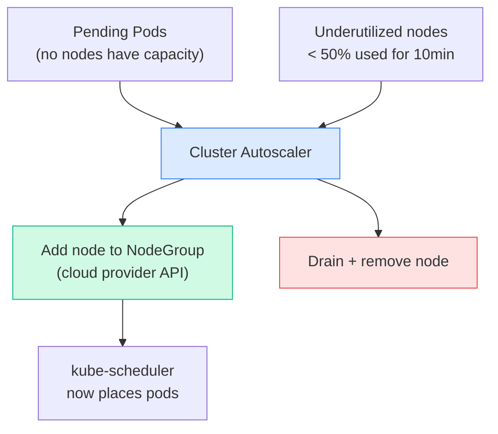

# HPA vs VPA
[Table Placeholder]

---

# 3. Cluster Autoscaler

Adds or removes **nodes** from the cluster when pods are unschedulable or nodes are underutilized.



```bash
# Cluster Autoscaler runs as a Deployment in kube-system
kubectl get deployment cluster-autoscaler -n kube-system

# View logs to see scaling decisions
kubectl logs -n kube-system deployment/cluster-autoscaler | grep -i scale

# Annotate node to prevent scale-down
kubectl annotate node node01 \
  cluster-autoscaler.kubernetes.io/scale-down-disabled=true

# Check why a node won't be removed
kubectl describe node node01 | grep -i autoscaler
```

---

# Quick Reference

```bash
# HPA
kubectl autoscale deployment myapp --cpu-percent=50 --min=2 --max=10
kubectl get hpa
kubectl get hpa -w                  # watch in real time
kubectl describe hpa myapp
kubectl delete hpa myapp

# VPA
kubectl get vpa
kubectl describe vpa myapp-vpa
kubectl get vpa myapp-vpa -o yaml | grep -A20 recommendation

# Metrics (required for HPA)
kubectl top pods
kubectl top nodes
kubectl get --raw /apis/metrics.k8s.io/v1beta1/pods
```

> 📚 **Ref:** [HPA Docs](https://kubernetes.io/docs/tasks/run-application/horizontal-pod-autoscale/) | [VPA Repo](https://github.com/kubernetes/autoscaler/tree/master/vertical-pod-autoscaler)
