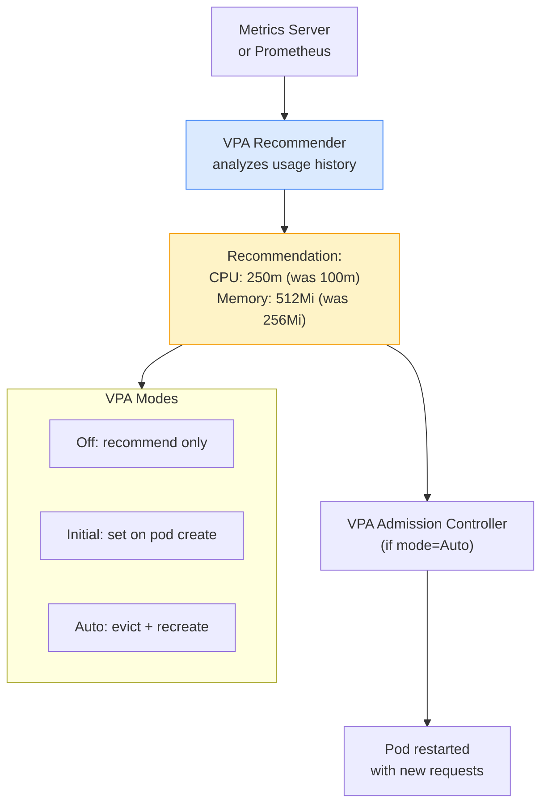

# HPA YAML (autoscaling/v2 — current API)
```yaml
apiVersion: autoscaling/v2
kind: HorizontalPodAutoscaler
metadata:
  name: myapp-hpa
spec:
  scaleTargetRef:
    apiVersion: apps/v1
    kind: Deployment
    name: myapp
  minReplicas: 2
  maxReplicas: 10
  metrics:
  # Scale on CPU
  - type: Resource
    resource:
      name: cpu
      target:
        type: Utilization
        averageUtilization: 50       # 50% of requested CPU
  # Scale on Memory
  - type: Resource
    resource:
      name: memory
      target:
        type: AverageValue
        averageValue: 512Mi
  # Scale on custom metric (e.g. requests per second)
  - type: Pods
    pods:
      metric:
        name: http_requests_per_second
      target:
        type: AverageValue
        averageValue: "1000"
  behavior:
    scaleUp:
      stabilizationWindowSeconds: 60   # wait 60s before scaling up again
      policies:
      - type: Pods
        value: 2
        periodSeconds: 60              # add max 2 pods per minute
    scaleDown:
      stabilizationWindowSeconds: 300  # wait 5min before scaling down
```

> **Requirements:** Metrics Server must be installed. Pods must have `resources.requests.cpu` set.

```bash
# HPA won't work without resource requests
# Verify:
kubectl describe pod myapp-xxx | grep -A5 Requests

# Watch HPA in real time
kubectl get hpa -w

# Generate load to test HPA
kubectl run load --image=busybox -- /bin/sh -c \
  'while true; do wget -q -O- http://myapp-svc; done'
```

---

# 2. VerticalPodAutoscaler (VPA)

Automatically adjusts **CPU and memory requests/limits** for containers based on historical usage — right-sizes pods instead of adding more.


