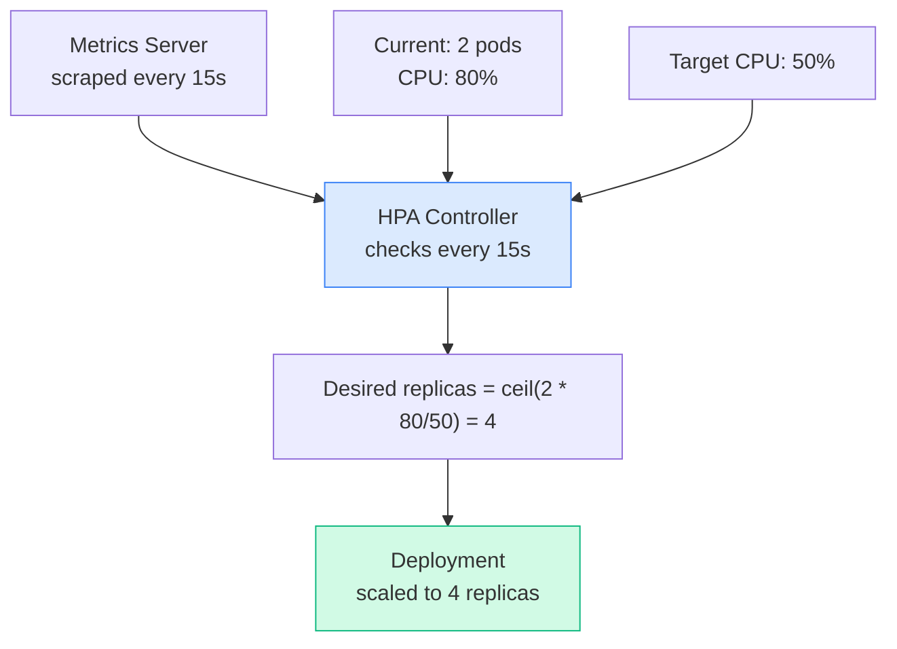

# Overview
> **Source:** CKA 2025/2026 Exam Curriculum | 📅 June 2026

All mechanisms for automatically scaling workloads in Kubernetes — HPA (horizontal), VPA (vertical), and KEDA (event-driven).

---

# 1. HorizontalPodAutoscaler (HPA)

Automatically scales **the number of pod replicas** based on observed CPU, memory, or custom metrics.

