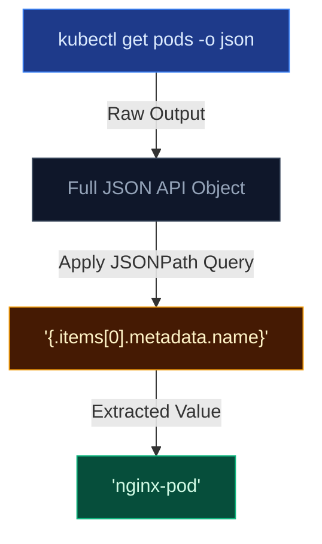

# JSONPath with kubectl

## What is JSONPath?

JSONPath is a query language for JSON. Kubernetes API responses are natively JSON. `kubectl` uses JSONPath with the `-o jsonpath=` flag to extract specific fields, filter lists, and format output programmatically.

---

## 🔄 JSONPath Flow



---

## 📖 Syntax Reference

| Expression | Meaning |
| --- | --- |
| `$` | Root element (usually omitted in kubectl) |
| `.` | Child element |
| `[N]` | Nth item in array (0-indexed) |
| `[*]` | All items in array |
| `[0:3]` | Slice: items 0, 1, 2 |
| `[-1]` | Last item |
| `[?(@.key=='val')]` | Filter: where key equals val |

---

## 🛠️ Practical Examples

```bash
# Get a single pod name
kubectl get pods -o jsonpath='{.items[0].metadata.name}'

# Get ALL pod names
kubectl get pods -o jsonpath='{.items[*].metadata.name}'

# Get pod names AND IPs (two fields separated by space)
kubectl get pods -o jsonpath='{.items[*].metadata.name} {.items[*].status.podIP}'

# Get image of first container in first pod
kubectl get pods -o jsonpath='{.items[0].spec.containers[0].image}'

# Filter: pods on a specific node
kubectl get pods -o jsonpath='{.items[?(@.spec.nodeName=="node01")].metadata.name}'

# Get service ClusterIP
kubectl get svc my-service -o jsonpath='{.spec.clusterIP}'

# Get all PV capacities sorted
kubectl get pv --sort-by=.spec.capacity.storage

# Sort nodes by CPU allocatable
kubectl get nodes --sort-by='.status.allocatable.cpu'
```

---

## 🗂️ Advanced Formatting (Loops & Columns)

For complex output, you can use `range` loops to iterate over items and print newlines `{"\n"}` or tabs `{"\t"}`.

```bash
# Newline-separated with range loop
kubectl get pods -o jsonpath='{range .items[*]}{.metadata.name}{"\t"}{.status.podIP}{"\n"}{end}'

# Node names and their OS
kubectl get nodes -o jsonpath='{range .items[*]}{.metadata.name}{"\t"}{.status.nodeInfo.osImage}{"\n"}{end}'

# Custom columns (often more readable than raw jsonpath)
kubectl get pods -o custom-columns='NAME:.metadata.name,IMAGE:.spec.containers[0].image,NODE:.spec.nodeName'

# Get secret value and decode it immediately
kubectl get secret my-secret -o jsonpath='{.data.password}' | base64 -d
```

---

## 🚀 Quick Reference Card

Keep these snippets handy for exams or scripts:

```bash
# === POD INFO ===
kubectl get pod <name> -o jsonpath='{.spec.nodeName}'
kubectl get pod <name> -o jsonpath='{.status.podIP}'
kubectl get pod <name> -o jsonpath='{.spec.containers[*].name}'
kubectl get pod <name> -o jsonpath='{.spec.containers[0].image}'

# === ALL PODS ===
kubectl get pods -o jsonpath='{range .items[*]}{.metadata.name}{","}{.status.phase}{"\n"}{end}'

# === NODES ===
kubectl get nodes -o jsonpath='{.items[*].metadata.name}'
kubectl get nodes -o jsonpath='{range .items[*]}{.metadata.name}{"\t"}{.status.addresses[0].address}{"\n"}{end}'

# === SECRETS & SERVICES ===
kubectl get secret <name> -o jsonpath='{.data.<key>}' | base64 -d
kubectl get svc <name> -o jsonpath='{.spec.clusterIP}'
kubectl get svc <name> -o jsonpath='{.spec.ports[0].nodePort}'
```
