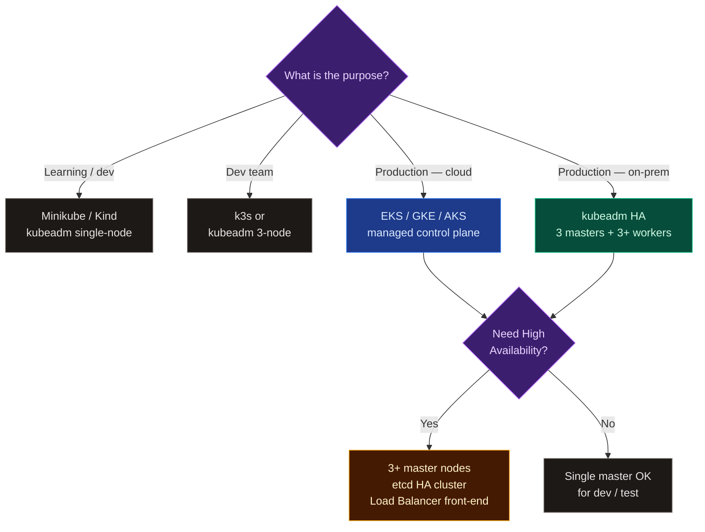
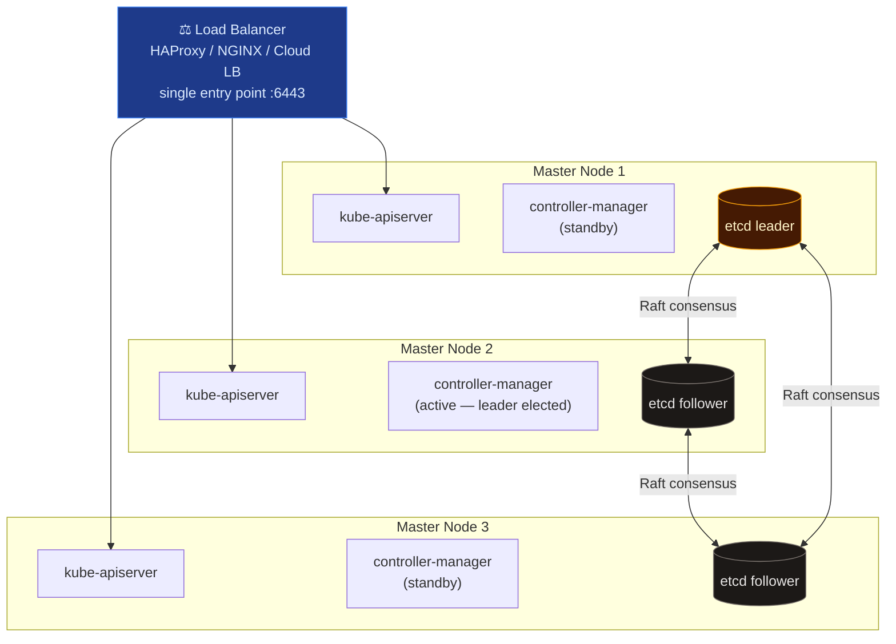

# Designing a Kubernetes Cluster

The right cluster design depends on your purpose, scale, and operational requirements. Key decisions include: managed vs self-managed, cloud vs on-prem, single-master vs HA, and node sizing.

---

## 🔄 Cluster Design Decision Tree

---

## 📐 Node Sizing Guidelines

| Role | Minimum | Recommended |
| --- | --- | --- |
| **Master (control plane)** | 2 CPU, 4 GB RAM | 4 CPU, 8 GB RAM |
| **Worker (general workloads)** | 2 CPU, 4 GB RAM | 4+ CPU, 16 GB RAM |
| **Worker (ML / GPU)** | 8 CPU, 32 GB RAM | Dedicated GPU nodes per workload |
| **etcd** | 2 CPU, 8 GB RAM | SSD-backed, low-latency network |

---

## 🏗️ HA Control Plane Architecture

In a High Availability setup, a **Load Balancer** sits in front of 3+ API servers. The controller-manager and scheduler use **leader election** (only one is active at a time), while all API servers serve requests actively.

| Component | Mode | Count |
| --- | --- | --- |
| **Load Balancer** | — | 1 (or HA pair) — single entry point for kubectl and kubelets |
| **kube-apiserver** | Active-active | 3 (one per master) — all serve requests simultaneously |
| **kube-controller-manager** | Active-passive | 3 — leader election, only one acts at a time |
| **kube-scheduler** | Active-passive | 3 — leader election, only one acts at a time |
| **etcd** | Raft cluster | 3 or 5 — quorum-based writes |

---

## 📊 Cluster Design Decision Matrix

| Requirement | Recommended Setup |
| --- | --- |
| Local learning / dev | Minikube, Kind, or kubeadm single-node |
| Small dev team | k3s or kubeadm 3-node |
| Production — cloud | EKS / GKE / AKS (managed control plane) |
| Production — on-prem | kubeadm HA (3 masters + 3+ workers + MAAS/bare-metal) |
| Air-gapped / regulated | kubeadm with private registry + offline packages |
