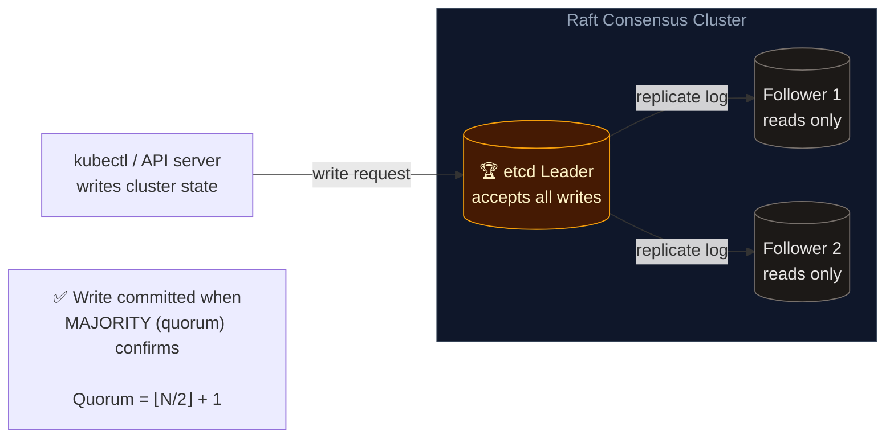
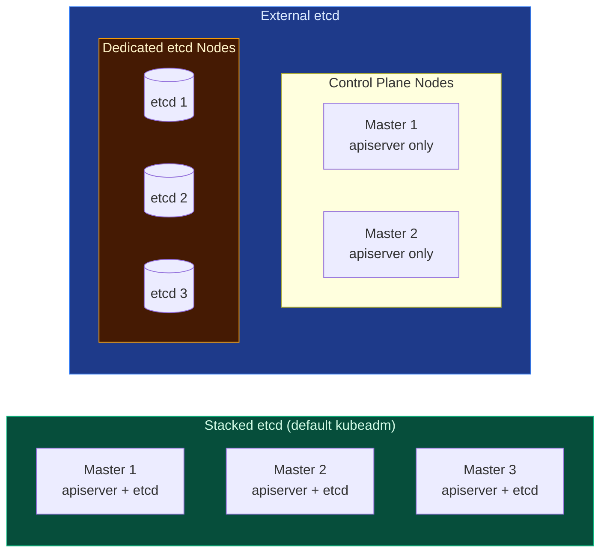

# etcd HA & Raft Consensus

**etcd** is the distributed key-value store that holds all Kubernetes cluster state. In a production cluster, etcd runs as a multi-node cluster using the **Raft consensus algorithm** to guarantee consistency and fault tolerance.

---

## 🔄 Raft Consensus in etcd



**Key principle**: writes are only committed once a **majority (quorum)** of nodes acknowledge — this prevents split-brain and data divergence.

---

## 📊 Quorum & Fault Tolerance Table

| etcd Nodes | Quorum Needed | Can Lose | Recommendation |
| --- | --- | --- | --- |
| **1** | 1 | 0 | ❌ No fault tolerance — dev only |
| **3** | 2 | 1 | ✅ Minimum for production |
| **5** | 3 | 2 | ✅ Recommended for production |
| **7** | 4 | 3 | ⚠️ Overkill for most clusters |

> ⚠️ **Always use an odd number of etcd nodes.** Using 4 nodes gives the same fault tolerance as 3 (can lose only 1) but introduces more risk in split-brain scenarios with no benefit.

---

## 🏗️ Stacked vs External etcd Topology



| Topology | Pros | Cons |
| --- | --- | --- |
| **Stacked etcd** | Fewer nodes, simpler to set up with kubeadm | etcd failure affects control plane; failure domains coupled |
| **External etcd** | Complete isolation between etcd and control plane | More nodes to manage, higher infrastructure cost |

---

## 🛠️ CLI Quick Reference

```bash
# Check etcd cluster health (run on a master node)
ETCDCTL_API=3 etcdctl \
  --endpoints=https://127.0.0.1:2379 \
  --cacert=/etc/kubernetes/pki/etcd/ca.crt \
  --cert=/etc/kubernetes/pki/etcd/server.crt \
  --key=/etc/kubernetes/pki/etcd/server.key \
  endpoint health

# List all etcd members and identify the leader
ETCDCTL_API=3 etcdctl \
  --endpoints=https://127.0.0.1:2379 \
  --cacert=/etc/kubernetes/pki/etcd/ca.crt \
  --cert=/etc/kubernetes/pki/etcd/server.crt \
  --key=/etc/kubernetes/pki/etcd/server.key \
  member list

# Take a snapshot backup of etcd
ETCDCTL_API=3 etcdctl snapshot save /opt/etcd-backup.db \
  --endpoints=https://127.0.0.1:2379 \
  --cacert=/etc/kubernetes/pki/etcd/ca.crt \
  --cert=/etc/kubernetes/pki/etcd/server.crt \
  --key=/etc/kubernetes/pki/etcd/server.key

# Verify snapshot integrity
ETCDCTL_API=3 etcdctl snapshot status /opt/etcd-backup.db --write-out=table
```
