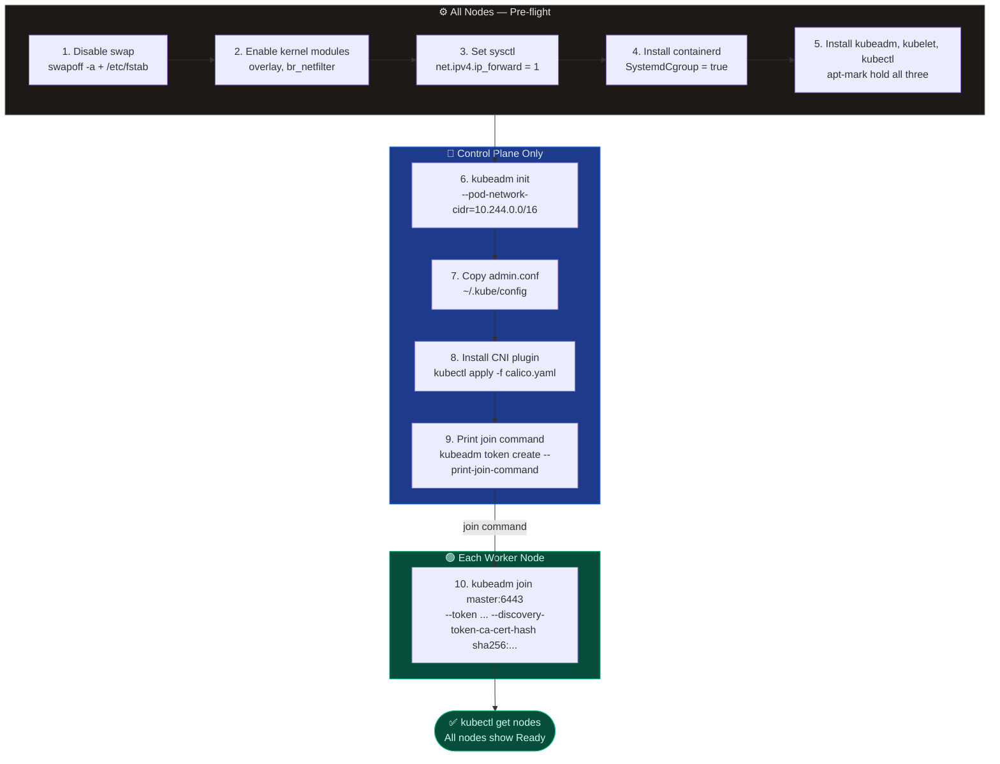

# kubeadm Cluster Installation

`kubeadm` is the official Kubernetes bootstrapping tool. It handles control plane initialisation, TLS certificate generation, kubeconfig creation, and worker node joining — but you must manually prepare the OS and install a container runtime first.

---

## 🔄 kubeadm Install Flow



| Phase | Node | Step |
| --- | --- | --- |
| **Pre-flight** | All nodes | Disable swap · enable kernel modules (`overlay`, `br_netfilter`) · set sysctl `ip_forward=1` |
| **Runtime** | All nodes | Install containerd · configure `SystemdCgroup=true` · restart containerd |
| **Packages** | All nodes | Install `kubeadm`, `kubelet`, `kubectl` · `apt-mark hold` all three |
| **Init** | Control plane | `kubeadm init --pod-network-cidr=10.244.0.0/16` |
| **kubeconfig** | Control plane | Copy `admin.conf` → `~/.kube/config` |
| **CNI** | Control plane | `kubectl apply -f calico.yaml` (or Flannel / Cilium / Weave) |
| **Join** | Each worker | `kubeadm join <master-ip>:6443 --token ... --discovery-token-ca-cert-hash sha256:...` |
| **Verify** | Control plane | `kubectl get nodes` — all nodes show `Ready` |

---

## 📄 Full Install Commands

```bash
# ═══════════════════════════════
# ALL NODES
# ═══════════════════════════════

# 1. Disable swap (required by kubelet)
swapoff -a
sed -i '/swap/d' /etc/fstab

# 2. Enable required kernel modules
cat > /etc/modules-load.d/k8s.conf << EOF
overlay
br_netfilter
EOF
modprobe overlay
modprobe br_netfilter

# 3. Set required sysctl params
cat > /etc/sysctl.d/k8s.conf << EOF
net.bridge.bridge-nf-call-iptables  = 1
net.bridge.bridge-nf-call-ip6tables = 1
net.ipv4.ip_forward                 = 1
EOF
sysctl --system

# 4. Install containerd
apt-get install -y containerd
mkdir -p /etc/containerd
containerd config default > /etc/containerd/config.toml
# Edit config.toml: set SystemdCgroup = true under [plugins."io.containerd.grpc.v1.cri".containerd.runtimes.runc.options]
sed -i 's/SystemdCgroup = false/SystemdCgroup = true/' /etc/containerd/config.toml
systemctl restart containerd
systemctl enable containerd

# 5. Install kubeadm, kubelet, kubectl (Kubernetes v1.29)
apt-get install -y apt-transport-https curl
curl -fsSL https://pkgs.k8s.io/core:/stable:/v1.29/deb/Release.key \
  | gpg --dearmor -o /etc/apt/keyrings/kubernetes-apt-keyring.gpg
echo 'deb [signed-by=/etc/apt/keyrings/kubernetes-apt-keyring.gpg] https://pkgs.k8s.io/core:/stable:/v1.29/deb/ /' \
  > /etc/apt/sources.list.d/kubernetes.list
apt-get update
apt-get install -y kubelet kubeadm kubectl
apt-mark hold kubelet kubeadm kubectl
```

```bash
# ═══════════════════════════════
# CONTROL PLANE ONLY
# ═══════════════════════════════

# 6. Initialise the control plane
kubeadm init \
  --pod-network-cidr=10.244.0.0/16 \
  --apiserver-advertise-address=<master-ip>

# 7. Configure kubectl access
mkdir -p $HOME/.kube
cp -i /etc/kubernetes/admin.conf $HOME/.kube/config
chown $(id -u):$(id -g) $HOME/.kube/config

# 8. Install CNI plugin (Calico)
kubectl apply -f https://raw.githubusercontent.com/projectcalico/calico/v3.26.0/manifests/calico.yaml

# 9. Generate join command for workers
kubeadm token create --print-join-command
```

```bash
# ═══════════════════════════════
# EACH WORKER NODE
# ═══════════════════════════════

# 10. Join the cluster (paste output of step 9)
kubeadm join <master-ip>:6443 \
  --token <token> \
  --discovery-token-ca-cert-hash sha256:<hash>

# Verify from control plane
kubectl get nodes    # all should show Ready
```
