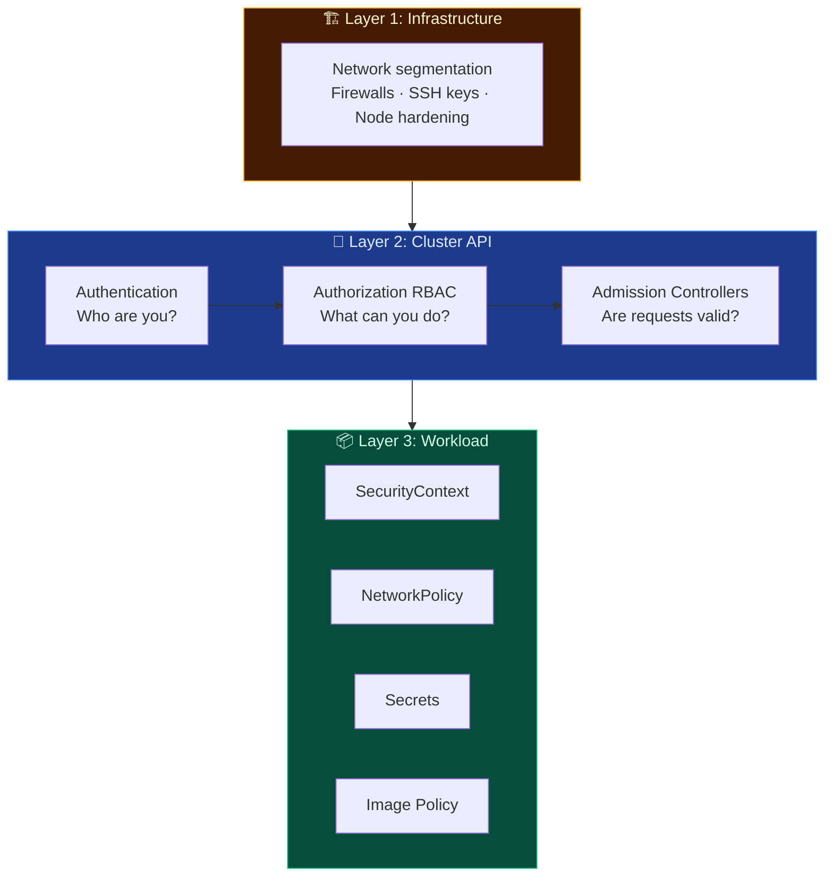
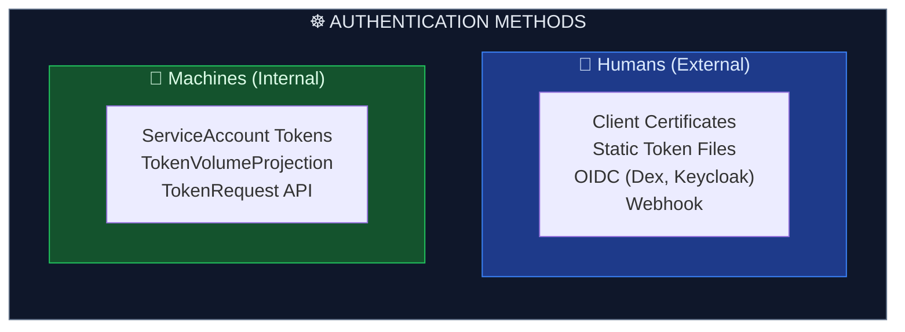

# Authentication in Kubernetes

Authentication is the first line of defense in securing a Kubernetes cluster. It answers the fundamental question: **Who is making the request?**

---

## 🏗️ Kubernetes Security Layers

Securing a Kubernetes cluster involves multiple security layers, spanning from the base virtual/physical nodes up to the application workloads.



---

## 👥 Humans vs. Machines

Kubernetes distinguishes between two categories of users: **Human Users** (acting outside the cluster, such as administrators and developers) and **ServiceAccounts** (representing in-cluster workload identities).



> ⚠️ **Key Difference:** Kubernetes does **not** have database records or objects representing human users natively inside etcd. Instead, human identities are verified through external mechanisms (e.g. usernames extracted from certificate Common Names or OIDC token claims). Only `ServiceAccounts` are managed as actual resources within the cluster.

---

## 🔄 How Authentication Works

Every HTTP request sent to the `kube-apiserver` must be authenticated. The API server evaluates requests by applying a set of enabled authenticator plugins:

1. **X.509 Client Certificates**: The API server validates certificates signed by the cluster's trusted Root Certificate Authority (CA). The user's name is extracted from the `CN` (Common Name) field, and groups are extracted from `O` (Organization) fields.
2. **OpenID Connect (OIDC) Tokens**: Integrates with external Single Sign-On (SSO) providers (e.g., Google, GitHub, Dex, Keycloak) using JSON Web Tokens (JWT).
3. **Webhook Token Authentication**: Delegates token verification to an external HTTP webhook API.
4. **ServiceAccount Tokens**: Pods carry auto-mounted JSON Web Tokens (JWT) representing their ServiceAccount, allowing them to communicate securely with the API server.

---

## ⚙️ ServiceAccount Configuration

Workloads communicate with the API server by assuming a **ServiceAccount** identity. 

```yaml
apiVersion: v1
kind: ServiceAccount
metadata:
  name: monitoring-sa
  namespace: default
```

When a Pod runs, it mounts a token from this ServiceAccount at a default path:
`/var/run/secrets/kubernetes.io/serviceaccount/token`

```yaml
apiVersion: v1
kind: Pod
metadata:
  name: monitor-app
  namespace: default
spec:
  serviceAccountName: monitoring-sa
  containers:
  - name: app
    image: prom/prometheus:v2.45.0
```

---

## 🛠️ CLI Quick Reference

```bash
# Create a new ServiceAccount
kubectl create serviceaccount web-analyzer

# View the details of a ServiceAccount
kubectl describe serviceaccount web-analyzer

# Request a temporary token manually for a ServiceAccount (TokenRequest API)
kubectl create token web-analyzer --duration=1h

# Check who you are authenticated as currently
kubectl auth can-i --list
```
