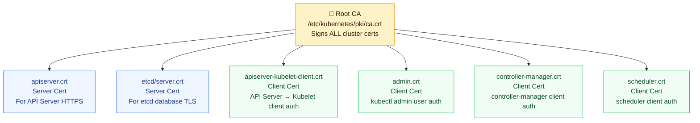

# TLS in Kubernetes (PKI Infrastructure)

Kubernetes requires secure TLS communication across all control plane components, worker nodes, and user interfaces. A typical cluster runs a full Public Key Infrastructure (PKI) system, where components present client or server certificates signed by the cluster's **Root Certificate Authority (CA)**.

---

## 🔄 TLS Certificate Map

All security and trust inside a Kubernetes cluster stems from the cluster **Root CA**. This CA signs certificates for both servers (e.g., the API server) and clients (e.g., the controller manager).



---

## 📂 Key Certificate Locations

In a standard cluster bootstrapped with `kubeadm`, all certificate assets live inside the `/etc/kubernetes/` directory:

| Component Certificate | File Paths | Purpose |
| --- | --- | --- |
| **Cluster Root CA** | `pki/ca.crt`<br>`pki/ca.key` | Signs all cluster component certs |
| **kube-apiserver Server Cert** | `pki/apiserver.crt`<br>`pki/apiserver.key` | Authenticates API server to clients |
| **etcd Server Cert** | `pki/etcd/server.crt`<br>`pki/etcd/server.key` | Secures etcd peer & client communications |
| **apiserver Kubelet Client Cert** | `pki/apiserver-kubelet-client.crt`<br>`pki/apiserver-kubelet-client.key` | Allows API server to securely contact kubelets |
| **admin Config User Cert** | `/etc/kubernetes/admin.conf` (embedded) | Embedded client cert/key for administrative access |

---

## 🛠️ CLI Operations: Inspect & Manage Certificates

### 1. Inspecting Certificate Details
To read the issuer, subject names, alternative DNS names (SANs), or expiration dates of a certificate file, use `openssl`:

```bash
# View certificate subject, issuer, and validity dates
openssl x509 -in /etc/kubernetes/pki/apiserver.crt -text -noout | grep -E 'Subject|Issuer|Not After'

# Check the Alternative Names (IPs/DNS names) the apiserver certificate is signed for
openssl x509 -in /etc/kubernetes/pki/apiserver.crt -text -noout | grep -A 1 "Subject Alternative Name"
```

### 2. Checking and Renewing Expirations using Kubeadm
All certificates created by `kubeadm` are valid for **1 year** by default. They are automatically renewed during cluster version upgrades, but you can check and renew them manually:

```bash
# Check validity and remaining days of all control plane certificates
kubeadm certs check-expiration

# Renew all control plane certificates immediately
kubeadm certs renew all

# Note: After renewing control plane certificates, restart the system containers
# to load the new certificates:
kill -s SIGHUP $(pgrep kube-apiserver)
kill -s SIGHUP $(pgrep kube-controller-manager)
kill -s SIGHUP $(pgrep kube-scheduler)
```

### 3. Extracting Certificates from Kubeconfigs
When troubleshooting client connectivity issues, you can extract and decode certificates directly from your `kubeconfig` file:

```bash
# Decode raw base64 client certificate data from admin kubeconfig
kubectl config view --raw -o jsonpath='{.users[0].user.client-certificate-data}' | base64 --decode > client.crt

# View details of the extracted client certificate
openssl x509 -in client.crt -text -noout | grep "Subject:"
```
