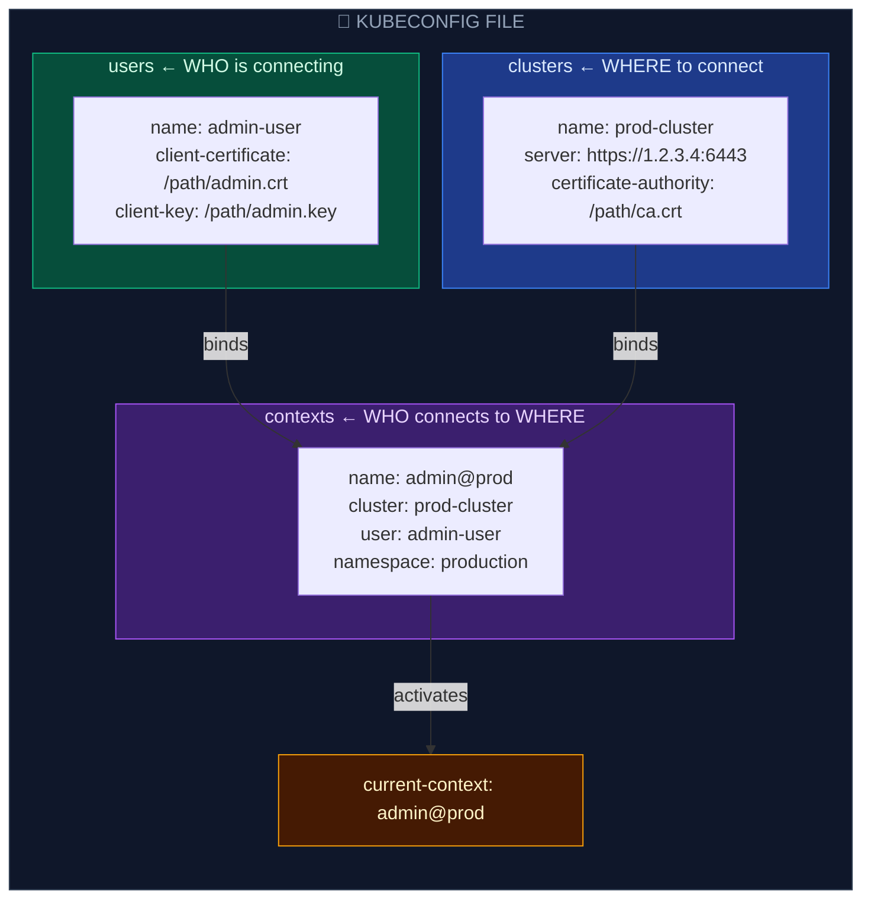

# Kubeconfig Configuration Files

A `kubeconfig` file is a structured YAML file used by `kubectl` and other Kubernetes clients to organize information about clusters, users, namespaces, and authentication mechanisms. It allows users to quickly switch between different clusters, roles, and namespaces.

---

## 📂 Kubeconfig Structure

A `kubeconfig` file consists of three key architectural blocks: **clusters**, **users**, and **contexts**.



- **Clusters**: Contains the endpoints (`server` URL) and TLS Certificate Authority (`certificate-authority` path or base64 embedded `certificate-authority-data`) of the API servers.
- **Users**: Contains the credentials to authenticate (Client certificates, token strings, client keys, or authentication command executors).
- **Contexts**: Binds a **User** to a specific **Cluster**, and assigns an optional default **Namespace**. The active environment is determined by the `current-context` field.

---

## 🛠️ CLI Operations: Managing Configurations

The `kubectl config` command group is used to safely view, update, and manage contexts in your active kubeconfig file.

### 1. Inspecting the Kubeconfig
```bash
# View the current active kubeconfig (redacts certificate and key contents)
kubectl config view

# View the raw, unredacted kubeconfig (shows complete base64 key data)
kubectl config view --raw

# Show the active context name directly
kubectl config current-context
```

### 2. Context Operations & Switching
```bash
# List all contexts defined in the kubeconfig
kubectl config get-contexts

# Switch active operations to a different context
kubectl config use-context admin@prod

# Set the default namespace for the current active context
kubectl config set-context --current --namespace=production
```

### 3. Setting Clusters and Credentials Imperatively
```bash
# Define a new cluster entry
kubectl config set-cluster dev-cluster --server=https://5.6.7.8:6443 --certificate-authority=/etc/kubernetes/pki/ca.crt

# Define a new token-based user credential entry
kubectl config set-credentials analyst-user --token=dG9rZW4tc3RyaW5nCg==

# Create a new context binding the user to the cluster
kubectl config set-context analyst@dev --cluster=dev-cluster --user=analyst-user --namespace=dev
```

---

## 🔄 Advanced: Managing Multiple Kubeconfig Files

By default, `kubectl` reads the config file located at `~/.kube/config`. You can override this using environments and flags:

```bash
# Explicitly use a specific configuration file for a command
kubectl get pods --kubeconfig=/etc/kubernetes/admin.conf

# Merge multiple kubeconfig files together
export KUBECONFIG=~/.kube/config:~/.kube/dev-config:~/.kube/prod-config

# Flatten the merged environments into a single, unified file
kubectl config view --flatten > ~/.kube/merged-config
```
