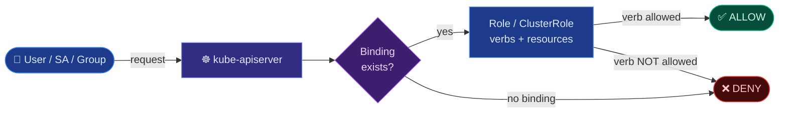

# Role-Based Access Control (RBAC)

Role-Based Access Control (RBAC) is the method Kubernetes uses to authorize requests sent to the `kube-apiserver`. It regulates access to resources based on the roles assigned to users, groups, or ServiceAccounts within the cluster.

---

## 🔄 RBAC Authorization Flow

When an authenticated identity makes a request, the API server checks if a binding connects the identity to a role that permits the requested API action (verbs) on the target resource.



---

## 📂 Core RBAC Architectural Elements

RBAC is built upon four primary API resources split by namespace scope:

| Scope | Resource | Purpose |
| --- | --- | --- |
| **Namespaced** | **Role** | Defines **WHAT** is allowed (a set of rules containing resources and verbs) inside a specific namespace. |
| **Namespaced** | **RoleBinding** | Connects **WHO** (User, Group, ServiceAccount) to a **Role**, granting permissions within that namespace. |
| **Cluster-wide** | **ClusterRole** | Defines **WHAT** is allowed cluster-wide (e.g. Nodes, PVs, Namespaces) or across all namespaces. |
| **Cluster-wide** | **ClusterRoleBinding** | Binds **WHO** to a **ClusterRole**, granting permissions cluster-wide. |

---

## 📄 YAML Resource Manifests

### 1. Namespaced Role & RoleBinding
A **Role** defines allowed actions. `apiGroups` indicates the API group (e.g., `"apps"` for Deployments, or `""` for Core group resources like Pods and Services).

```yaml
# Role — Defines the allowed actions
apiVersion: rbac.authorization.k8s.io/v1
kind: Role
metadata:
  name: pod-reader
  namespace: default
rules:
- apiGroups: [""]              # "" indicates the core API group
  resources: ["pods", "pods/log"]
  verbs: ["get", "list", "watch"]
- apiGroups: ["apps"]
  resources: ["deployments"]
  verbs: ["get", "list"]
```

```yaml
# RoleBinding — Binds Jane and a ServiceAccount to the pod-reader Role
apiVersion: rbac.authorization.k8s.io/v1
kind: RoleBinding
metadata:
  name: read-pods-binding
  namespace: default
subjects:
- kind: User
  name: jane
  apiGroup: rbac.authorization.k8s.io
- kind: ServiceAccount
  name: monitoring-sa
  namespace: monitoring
roleRef:
  kind: Role
  name: pod-reader
  apiGroup: rbac.authorization.k8s.io
```

### 2. ClusterRole & ClusterRoleBinding
Used for non-namespaced resources (like Nodes) or to allow read access across all namespaces.

```yaml
# ClusterRole — Defines cluster-wide read-only rules
apiVersion: rbac.authorization.k8s.io/v1
kind: ClusterRole
metadata:
  name: node-reader
rules:
- apiGroups: [""]
  resources: ["nodes", "namespaces", "persistentvolumes"]
  verbs: ["get", "list", "watch"]
```

```yaml
# ClusterRoleBinding — Binds user Jane to the node-reader ClusterRole cluster-wide
apiVersion: rbac.authorization.k8s.io/v1
kind: ClusterRoleBinding
metadata:
  name: read-nodes-global
subjects:
- kind: User
  name: jane
  apiGroup: rbac.authorization.k8s.io
roleRef:
  kind: ClusterRole
  name: node-reader
  apiGroup: rbac.authorization.k8s.io
```

---

## 🛠️ CLI Operations: Safe Generation & Access Audits

Avoid writing RBAC YAML files from scratch during exams. Use imperative commands to generate manifests or apply configurations directly.

### 1. Creating RBAC Resources Imperatively
```bash
# Create a Role with specific resource verbs
kubectl create role pod-reader --verb=get,list,watch --resource=pods -n default

# Bind a User to a Role
kubectl create rolebinding read-pods --role=pod-reader --user=jane -n default

# Bind a ServiceAccount in another namespace to a Role
kubectl create rolebinding monitor-bind --role=pod-reader --serviceaccount=monitoring:monitoring-sa -n default

# Create a ClusterRole imperatively
kubectl create clusterrole cluster-reader --verb=get,list --resource='*.*'
```

### 2. Auditing Access Authorization (`kubectl auth can-i`)
Always verify that your RBAC policies enforce the **Principle of Least Privilege** using access checking:

```bash
# Check if you can create a deployment
kubectl auth can-i create deployments

# Check if user 'jane' can delete pods in the 'default' namespace
kubectl auth can-i delete pods --as=jane -n default

# Check if ServiceAccount 'monitoring-sa' in namespace 'monitoring' can get secrets inside 'production'
kubectl auth can-i get secrets --as=system:serviceaccount:monitoring:monitoring-sa -n production

# List everything your current authenticated user is authorized to do
kubectl auth can-i --list
```
