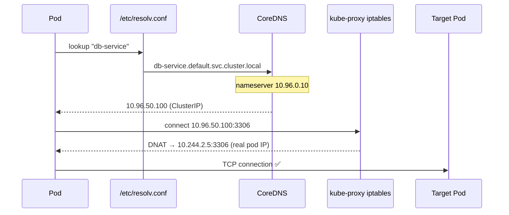

# DNS in Kubernetes (CoreDNS)

Kubernetes runs **CoreDNS** as the cluster-internal DNS server. Every pod is configured (via `/etc/resolv.conf`) to send DNS queries to CoreDNS, which resolves Service and Pod names to their cluster IPs — enabling name-based service discovery.

---

## 🔄 DNS Resolution Flow



| Step | What Happens |
| --- | --- |
| 1️⃣ | Pod looks up `db-service` |
| 2️⃣ | Pod's `/etc/resolv.conf` → `search default.svc.cluster.local svc.cluster.local cluster.local` |
| 3️⃣ | OS appends search domain → `db-service.default.svc.cluster.local` |
| 4️⃣ | Query goes to CoreDNS at `10.96.0.10` (kube-dns ClusterIP) |
| 5️⃣ | CoreDNS resolves to Service ClusterIP e.g. `10.100.50.25` |
| 6️⃣ | iptables/IPVS on node forwards to actual pod IP |

---

## 📂 DNS Record Formats

| Resource | DNS Format | Example |
| --- | --- | --- |
| **Service** | `<svc>.<namespace>.svc.cluster.local` | `db-service.default.svc.cluster.local` |
| **Pod** | `<pod-ip-dashes>.<namespace>.pod.cluster.local` | `10-244-1-5.default.pod.cluster.local` |
| **Headless Service** | Returns all pod IPs (A records) | `mongo.default.svc.cluster.local` → multiple IPs |

---

## ⚙️ CoreDNS Configuration

CoreDNS is deployed as a **Deployment** in the `kube-system` namespace and its behaviour is controlled via a **ConfigMap** called `coredns` (the Corefile):

```bash
# CoreDNS pods
kubectl get pods -n kube-system -l k8s-app=kube-dns

# CoreDNS ConfigMap (Corefile)
kubectl get cm -n kube-system coredns -o yaml
```

```yaml
# Example Corefile section (inside the ConfigMap)
.:53 {
    errors
    health
    kubernetes cluster.local in-addr.arpa ip6.arpa {
       pods insecure
       fallthrough in-addr.arpa ip6.arpa
    }
    forward . /etc/resolv.conf    # upstream DNS for external names
    cache 30
    loop
    reload
    loadbalance
}
```

---

## 🛠️ CLI Quick Reference

```bash
# Test DNS from a temporary pod
kubectl run dns-test --image=busybox --rm -it -- nslookup kubernetes
kubectl run dns-test --image=busybox --rm -it -- nslookup my-service.production

# Check a pod's DNS resolver config
kubectl exec nginx -- cat /etc/resolv.conf
# nameserver 10.96.0.10
# search default.svc.cluster.local svc.cluster.local cluster.local

# View CoreDNS logs for query debugging
kubectl logs -n kube-system -l k8s-app=kube-dns

# DNS lookup for a specific service
kubectl exec -it busybox -- nslookup my-service.default.svc.cluster.local
```
