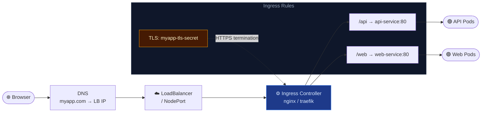

# Ingress

An **Ingress** is a Kubernetes API object that defines HTTP/HTTPS routing rules. It requires an **Ingress Controller** (e.g. NGINX, Traefik, HAProxy) running inside the cluster to act as the actual reverse proxy and apply those rules.

---

## 🔄 Ingress Traffic Flow



| Step | Component | Action |
| --- | --- | --- |
| 1️⃣ | **DNS** | `myapp.com` resolves to LoadBalancer / NodePort IP |
| 2️⃣ | **LoadBalancer** | Routes to Ingress Controller pods |
| 3️⃣ | **Ingress Controller** (nginx/traefik) | Reads Ingress resources, applies routing rules |
| 4️⃣ | **Ingress Rule** | `host: myapp.com, path: /api` → `api-service:80` |
| 5️⃣ | **Service** | Routes to backend pods via iptables |

---

## ⚙️ Install NGINX Ingress Controller

```bash
# Install NGINX Ingress Controller (cloud provider)
kubectl apply -f https://raw.githubusercontent.com/kubernetes/ingress-nginx/controller-v1.9.0/deploy/static/provider/cloud/deploy.yaml

# Verify
kubectl get pods -n ingress-nginx
kubectl get svc -n ingress-nginx
```

---

## 📄 YAML Manifests

### Path-Based Routing

```yaml
# Route /api → api-service and /web → web-service
apiVersion: networking.k8s.io/v1
kind: Ingress
metadata:
  name: myapp-ingress
  annotations:
    nginx.ingress.kubernetes.io/rewrite-target: /
spec:
  ingressClassName: nginx
  rules:
  - host: myapp.com
    http:
      paths:
      - path: /api
        pathType: Prefix
        backend:
          service:
            name: api-service
            port:
              number: 80
      - path: /web
        pathType: Prefix
        backend:
          service:
            name: web-service
            port:
              number: 80
```

### Host-Based Routing + TLS

```yaml
# Route api.myapp.com and web.myapp.com with HTTPS
apiVersion: networking.k8s.io/v1
kind: Ingress
metadata:
  name: multi-host-ingress
spec:
  ingressClassName: nginx
  tls:
  - hosts:
    - api.myapp.com
    - web.myapp.com
    secretName: myapp-tls-secret    # TLS cert stored as a Secret
  rules:
  - host: api.myapp.com
    http:
      paths:
      - path: /
        pathType: Prefix
        backend:
          service:
            name: api-service
            port:
              number: 80
  - host: web.myapp.com
    http:
      paths:
      - path: /
        pathType: Prefix
        backend:
          service:
            name: web-service
            port:
              number: 80
```

---

## 🛠️ CLI Quick Reference

```bash
# List all Ingress resources across all namespaces
kubectl get ingress -A

# Inspect routing rules and events
kubectl describe ingress myapp-ingress

# List available IngressClasses
kubectl get ingressclass

# Create a TLS secret for HTTPS termination
kubectl create secret tls myapp-tls-secret \
  --cert=path/to/tls.crt \
  --key=path/to/tls.key
```
