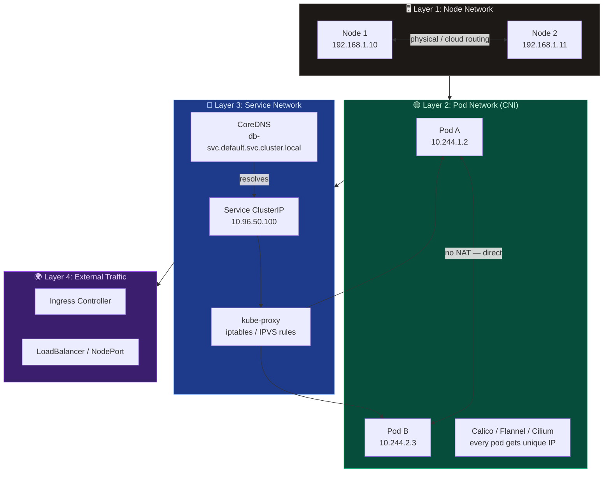
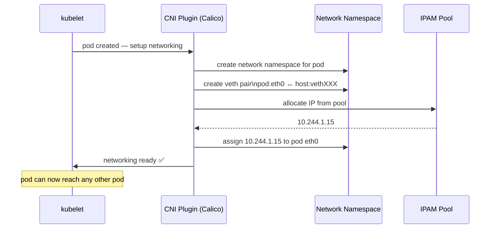

# Pod Networking & CNI

Kubernetes requires every pod to have a unique IP address and mandates that pods can communicate with each other directly — without Network Address Translation (NAT). This is achieved through **CNI (Container Network Interface)** plugins.

---

## 🌐 Kubernetes Networking Requirements

Three fundamental rules govern all Kubernetes networking:

1. **Every pod must have a unique IP** — no two pods can share an IP across the cluster
2. **All pods can communicate with all other pods without NAT** — direct pod-to-pod connectivity
3. **All nodes can communicate with all pods without NAT** — bidirectional node-pod reachability

---

## 🏗️ Networking Layers Overview



---

## ⚙️ CNI Plugin Flow

When a pod is created, `kubelet` delegates all network setup to the configured CNI plugin:



| Step | What CNI Does |
| --- | --- |
| 1️⃣ | Pod created → kubelet calls CNI plugin |
| 2️⃣ | CNI creates a network namespace for the pod |
| 3️⃣ | Creates a virtual ethernet pair (`eth0` in pod ↔ `vethXXX` on host) |
| 4️⃣ | Assigns IP to pod from IPAM pool |
| 5️⃣ | Sets up routes so pod is reachable cluster-wide |

---

## 📦 Popular CNI Plugins

| Plugin | Highlights |
| --- | --- |
| **Calico** | BGP-based routing, NetworkPolicy support, high performance |
| **Flannel** | Simple overlay (VXLAN), easy setup, limited policy support |
| **Cilium** | eBPF-based, L7-aware policies, observability built-in |
| **Weave** | Mesh overlay, automatic encryption, simple to deploy |

---

## 🛠️ CLI Quick Reference

```bash
# Check CNI plugin installed on node
ls /etc/cni/net.d/
ls /opt/cni/bin/

# Inspect CNI config
cat /etc/cni/net.d/10-calico.conflist

# Node IPs
kubectl get nodes -o wide

# Network interfaces on node
ip addr show
ip route

# Pod IPs
kubectl get pods -o wide

# Inspect networking inside a pod
kubectl exec -it nginx -- ip addr show
kubectl exec -it nginx -- ip route
```
