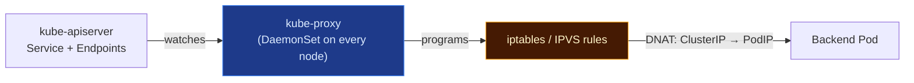

# Service Networking

A **Service** provides a stable virtual IP (ClusterIP) and DNS name for a group of pods — even as pods are created, replaced, or scaled. Traffic is forwarded from the ClusterIP to actual pod IPs by `kube-proxy` using iptables or IPVS rules on every node.

---

## 🔄 Service Types & Traffic Flow

```mermaid
flowchart TD
    subgraph CIP["ClusterIP — Internal Only"]
        CP["Client Pod"] -->|"ClusterIP:80"| IPT1["iptables / IPVS"] -->|"DNAT"| CPD["Backend Pod"]
    end
    subgraph NP["NodePort — Node-level External"]
        BR1["Browser"] -->|"NodeIP:30080"| NPC["ClusterIP:80"] --> IPT2["iptables"] --> NPD["Backend Pod"]
    end
    subgraph LB["LoadBalancer — Cloud External"]
        BR2["Browser"] -->|"LB IP:80"| LBN["Cloud LB"] --> NP2["NodePort"] --> CIP2["ClusterIP"] --> LBD["Backend Pod"]
    end
    subgraph EN["ExternalName — DNS Alias"]
        INT["Internal Pod"] -->|"CNAME"| EXT["external.service.com"]
    end

    style CIP fill:#064e3b,stroke:#10b981,color:#d1fae5
    style NP  fill:#1e3a8a,stroke:#3b82f6,color:#dbeafe
    style LB  fill:#3b1f6e,stroke:#a855f7,color:#e9d5ff
    style EN  fill:#451a03,stroke:#f59e0b,color:#fef3c7
```



| Type | How Traffic Reaches Pod | Use Case |
| --- | --- | --- |
| **ClusterIP** (default) | `Client Pod → ClusterIP:80 → iptables → Pod` | Internal microservice communication |
| **NodePort** | `Browser → NodeIP:30080 → ClusterIP:80 → Pod` | Dev/testing, on-prem external access |
| **LoadBalancer** | `Browser → Cloud LB IP → NodePort → ClusterIP → Pod` | Production cloud deployments |
| **ExternalName** | `Internal → CNAME → external.service.com` | Access external services by internal DNS name |

---

## 📄 YAML Manifests

```yaml
# ClusterIP — internal only (default)
apiVersion: v1
kind: Service
metadata:
  name: api-service
  namespace: default
spec:
  selector:
    app: api
  ports:
  - port: 80
    targetPort: 8080
  type: ClusterIP
```

```yaml
# NodePort — accessible on every node at a static port
apiVersion: v1
kind: Service
metadata:
  name: web-service
spec:
  selector:
    app: web
  ports:
  - port: 80
    targetPort: 8080
    nodePort: 30080    # range: 30000–32767
  type: NodePort
```

---

## ⚙️ kube-proxy Role

`kube-proxy` runs as a DaemonSet on every node. It watches the API server for Service and Endpoint changes and programs the node's kernel (iptables or IPVS) to forward traffic from the virtual ClusterIP to the actual pod IPs.



---

## 🛠️ CLI Quick Reference

```bash
# List all services and their ClusterIPs
kubectl get svc
kubectl get svc -o wide

# View endpoints (actual pod IPs) behind a service
kubectl get endpoints api-service

# Check kube-proxy mode (iptables or ipvs)
kubectl get cm -n kube-system kube-proxy -o yaml | grep mode

# View iptables rules for a service IP
iptables -t nat -L KUBE-SERVICES | grep <service-ip>

# DNS resolution test from inside a pod
kubectl exec -it busybox -- nslookup my-service.default.svc.cluster.local
```
