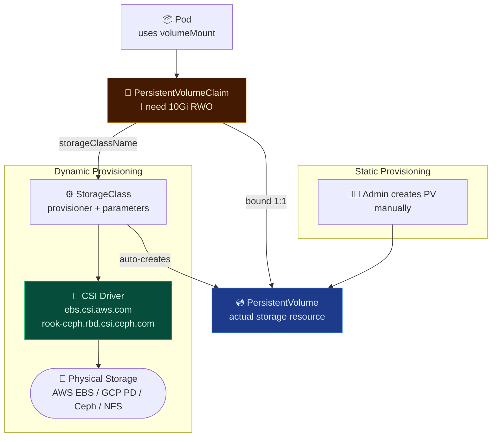
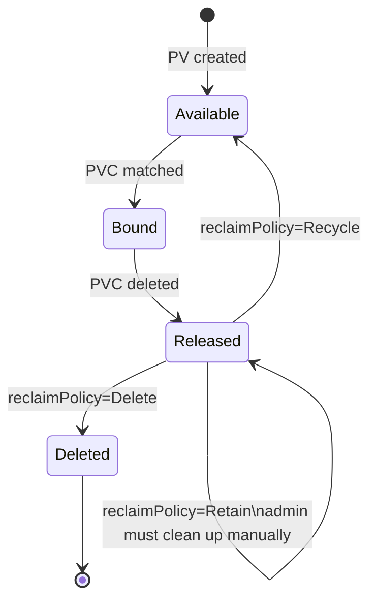
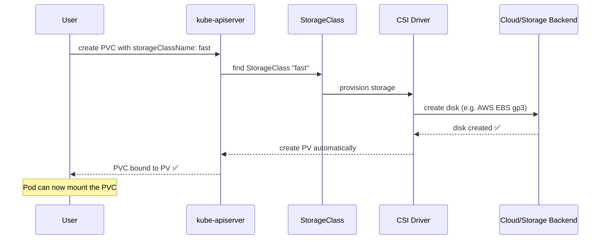

# Kubernetes Storage Architecture

Kubernetes separates storage resource provisioning from the actual workload requirements using a decoupled architecture of **PersistentVolumes (PV)**, **PersistentVolumeClaims (PVC)**, and dynamic **StorageClasses (SC)**.

---

## 🏗️ Storage Architecture — Pod to Disk

This diagram maps how a Pod's volume request travels from a claim down to the physical/cloud block storage backend.



---

## 📂 1. Volumes

Kubernetes supports multiple types of volumes that mount external, host, or temporary directories directly inside your containers.

| Type | Description | Use Case |
| --- | --- | --- |
| `emptyDir` | Temporary directory that lives and dies with the Pod | Scratch space, caching, shared folders between containers |
| `hostPath` | Mounts a file/directory from the host node's filesystem | DaemonSets, node-level log monitoring agents |
| `configMap` | Mounts ConfigMap values as flat configuration files | Injecting dynamic app settings and environment properties |
| `secret` | Mounts Secret payloads as encrypted files | Injecting TLS certificates, access tokens, API credentials |
| `persistentVolumeClaim` | Claims a PersistentVolume | Databases, message queues, stateful state-preserving applications |
| `nfs` | Mounts a shared NFS directory across multiple nodes | Multi-node shared read-write access to static resources |

### 📄 Share Data via `emptyDir`
Below is a multi-container Pod that shares a writeable temporary directory using `emptyDir`:

```yaml
apiVersion: v1
kind: Pod
metadata:
  name: shared-volume-pod
spec:
  containers:
  - name: writer
    image: busybox
    command: ['sh', '-c', 'echo hello > /data/hello.txt; sleep 3600']
    volumeMounts:
    - name: shared-data
      mountPath: /data
  - name: reader
    image: busybox
    command: ['sh', '-c', 'cat /data/hello.txt; sleep 3600']
    volumeMounts:
    - name: shared-data
      mountPath: /data
  volumes:
  - name: shared-data
    emptyDir: {}    # deleted permanently when pod is deleted
```

---

## 💿 2. PersistentVolumes (PV)

A **PersistentVolume (PV)** is a piece of storage in the cluster that has been provisioned by an administrator or dynamically provisioned using StorageClasses. It is a resource in the cluster just like a node is a cluster resource.



### 📄 Static PersistentVolume Manifest
```yaml
apiVersion: v1
kind: PersistentVolume
metadata:
  name: pv-database
spec:
  capacity:
    storage: 10Gi
  accessModes:
  - ReadWriteOnce         # RWO: Only one node can mount as read-write
  persistentVolumeReclaimPolicy: Retain
  storageClassName: manual
  hostPath:
    path: /data/db        # For development/local testing only
```

### 🔄 Access Modes Reference

| Mode | Short | Meaning | Typical Storage Backend |
| --- | --- | --- | --- |
| `ReadWriteOnce` | RWO | Only a single **node** can mount the volume as read-write | AWS EBS, GCP Persistent Disk, Azure Disk |
| `ReadOnlyMany` | ROX | Multiple nodes can mount the volume as **read-only** | NFS, CephFS |
| `ReadWriteMany` | RWX | Multiple nodes can mount the volume as **read-write** | NFS, CephFS, AWS EFS |
| `ReadWriteOncePod` | RWOP | Only a single **Pod** can mount the volume as read-write (K8s 1.22+) | Any CSI driver supporting exclusive single-pod access |

---

## 🎫 3. PersistentVolumeClaims (PVC)

A **PersistentVolumeClaim (PVC)** is a request for storage by a user. It is similar to a Pod. Pods consume node resources and PVCs consume PV resources. Claims can request specific size and access modes.

```yaml
# PVC — Requesting 5Gi of ReadWriteOnce storage
apiVersion: v1
kind: PersistentVolumeClaim
metadata:
  name: db-pvc
spec:
  accessModes:
  - ReadWriteOnce
  storageClassName: manual    # Must match the PV's storageClassName
  resources:
    requests:
      storage: 5Gi
```

```yaml
# Pod — Mounting the PVC as a database folder
apiVersion: v1
kind: Pod
metadata:
  name: postgres-pod
spec:
  containers:
  - name: postgres
    image: postgres:15
    env:
    - name: POSTGRES_PASSWORD
      value: mysecret
    volumeMounts:
    - name: db-storage
      mountPath: /var/lib/postgresql/data
  volumes:
  - name: db-storage
    persistentVolumeClaim:
      claimName: db-pvc
```

### 🛠️ CLI Operations: Auditing PVs and Claims
```bash
# Check the status of PVs (should show Bound to default/db-pvc)
kubectl get pv

# Check the status of PVCs
kubectl get pvc

# Detailed inspection of a PVC
kubectl describe pvc db-pvc
```

---

## ⚙️ 4. StorageClasses (Dynamic Provisioning)

Dynamic provisioning allows storage volumes to be created on-demand. When a creator requests a StorageClass, the class uses a Container Storage Interface (CSI) driver to automatically provision a volume in the cloud or on-prem storage backend.



### 📄 Dynamic StorageClass Manifests

```yaml
# AWS EBS gp3 StorageClass
apiVersion: storage.k8s.io/v1
kind: StorageClass
metadata:
  name: fast
  annotations:
    storageclass.kubernetes.io/is-default-class: "true"  # Set as default StorageClass
provisioner: ebs.csi.aws.com
parameters:
  type: gp3
  iops: "3000"
  throughput: "125"
volumeBindingMode: WaitForFirstConsumer   # Delays volume creation until pod is scheduled
reclaimPolicy: Delete                     # Delete underlying disk when PVC is deleted
allowVolumeExpansion: true                # Allows volume size expansion on the fly
```

```yaml
# Ceph/Rook Block StorageClass
apiVersion: storage.k8s.io/v1
kind: StorageClass
metadata:
  name: rook-ceph-block
provisioner: rook-ceph.rbd.csi.ceph.com
parameters:
  clusterID: rook-ceph
  pool: replicapool
  imageFormat: "2"
  imageFeatures: layering
  csi.storage.k8s.io/provisioner-secret-name: rook-csi-rbd-provisioner
  csi.storage.k8s.io/provisioner-secret-namespace: rook-ceph
reclaimPolicy: Delete
allowVolumeExpansion: true
```

### 📄 Dynamic PVC utilizing StorageClass
```yaml
apiVersion: v1
kind: PersistentVolumeClaim
metadata:
  name: dynamic-db-pvc
spec:
  accessModes:
  - ReadWriteOnce
  storageClassName: fast    # Triggers dynamic provisioning via the AWS CSI driver
  resources:
    requests:
      storage: 20Gi
```

### 🛠️ CLI Operations: Managing StorageClasses
```bash
# Check the storage classes on the cluster
kubectl get storageclass
kubectl get sc

# Expand a PVC capacity (requires allowVolumeExpansion: true in StorageClass)
kubectl patch pvc dynamic-db-pvc -p '{"spec":{"resources":{"requests":{"storage":"50Gi"}}}}'
```
