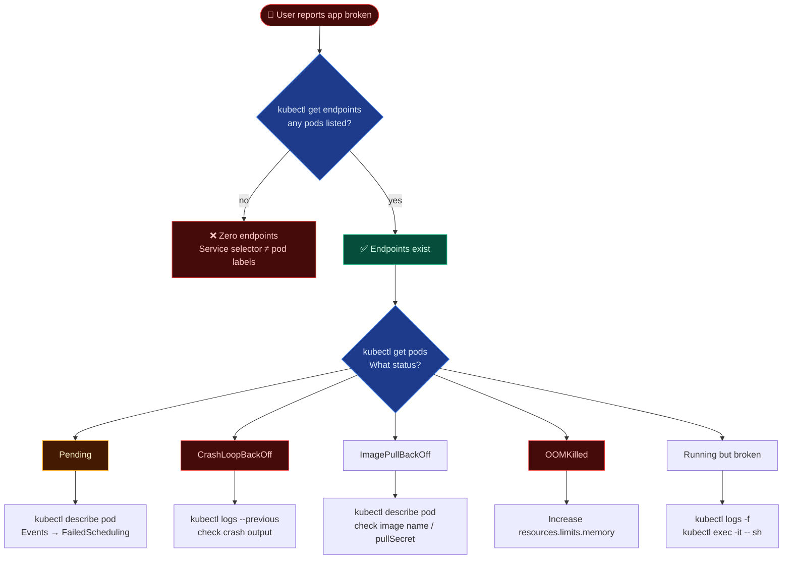

# Application Failure Troubleshooting

When a user reports that an application is broken, a systematic approach is essential. Start from the Service and work your way down to the individual Pods.

---

## 🔄 Troubleshooting Flow



---

## 🛑 Common Issues & Fixes

| Symptom | Likely Cause | Fix |
| --- | --- | --- |
| Pod `Pending` | No node can schedule | Check resources, taints, nodeSelector |
| Pod `CrashLoopBackOff` | App crashes on start | `kubectl logs --previous` |
| Pod `ImagePullBackOff` | Wrong image or registry creds | Check image name, imagePullSecret |
| Pod `OOMKilled` | Exceeds memory limit | Increase memory limit |
| `0/N endpoints` on service | Label mismatch | Check service selector vs pod labels |
| `ERR_CONNECTION_REFUSED` | App not listening on correct port | Check containerPort vs service port |

---

## 🔄 Common Pod Status Quick Reference

| Status | Meaning | First Check |
| --- | --- | --- |
| `Pending` | Not scheduled yet | `kubectl describe pod` → Events: FailedScheduling |
| `Init:N/M` | Init container N of M still running | `kubectl logs <pod> -c <init-container-name>` |
| `PodInitializing` | All init containers done, main starting | Normal — wait |
| `Running` | All containers running | Check logs if app behaves wrong |
| `CrashLoopBackOff` | Container keeps crashing | `kubectl logs --previous` |
| `OOMKilled` | Exceeded memory limit | Increase `resources.limits.memory` |
| `ImagePullBackOff` | Cannot pull image | Check image name, tag, imagePullSecret |
| `Terminating` | Pod being deleted | Check for finalizers blocking deletion |
| `Evicted` | Node pressure evicted the pod | Check node disk/memory pressure |

---

## 🛠️ CLI Quick Reference

```bash
# Full app troubleshooting sequence
kubectl get all -n <namespace>               # overview
kubectl get endpoints <svc-name>             # any pods behind service?
kubectl describe pod <pod-name>              # events, state
kubectl logs <pod-name>                      # app logs
kubectl logs <pod-name> --previous           # crash logs
kubectl exec -it <pod-name> -- /bin/sh       # shell in
kubectl exec -it <pod-name> -- env           # check env vars
kubectl exec -it <pod-name> -- curl localhost:8080/health  # test internally
```
