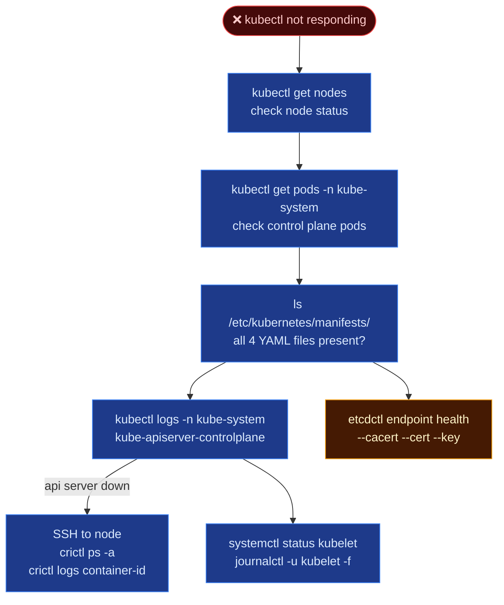

# Control Plane Failure

When the control plane goes down, `kubectl` stops responding, and you may lose the ability to manage the cluster. Since the API server is unavailable, you must SSH directly into the control plane nodes to diagnose the issue.

---

## 🔄 Control Plane Failure Flow



---

## 🛑 Troubleshooting Steps

| Step | Check | Command |
| --- | --- | --- |
| 1️⃣ | **Node status** | `kubectl get nodes` |
| 2️⃣ | **Control plane pods** | `kubectl get pods -n kube-system` |
| 3️⃣ | **Static pod manifests** | `ls /etc/kubernetes/manifests/` — all 4 files present? |
| 4️⃣ | **API server logs** | `kubectl logs -n kube-system kube-apiserver-controlplane` |
| 5️⃣ | **API server down?** | SSH to node → `crictl ps -a` → `crictl logs <container-id>` |
| 6️⃣ | **kubelet** | `systemctl status kubelet`  • `journalctl -u kubelet -f` |
| 7️⃣ | **etcd health** | `etcdctl endpoint health --endpoints=... --cacert=... --cert=... --key=...` |

---

## 🛠️ CLI Quick Reference

```bash
# Control plane pod logs (if API server is up)
kubectl logs -n kube-system kube-apiserver-controlplane
kubectl logs -n kube-system kube-controller-manager-controlplane
kubectl logs -n kube-system kube-scheduler-controlplane
kubectl logs -n kube-system etcd-controlplane

# If API server is down, SSH to the master node and use crictl/journalctl
ssh controlplane
crictl ps -a | grep kube-apiserver   # check running containers
crictl logs <container-id>           # view container logs directly
journalctl -u kubelet -f             # check if kubelet is failing to start static pods

# Check static pod manifests for misconfigurations
cat /etc/kubernetes/manifests/kube-apiserver.yaml
cat /etc/kubernetes/manifests/etcd.yaml

# etcd health check
export ETCDCTL_API=3
etcdctl endpoint health \
  --endpoints=https://127.0.0.1:2379 \
  --cacert=/etc/kubernetes/pki/etcd/ca.crt \
  --cert=/etc/kubernetes/pki/etcd/server.crt \
  --key=/etc/kubernetes/pki/etcd/server.key
```
